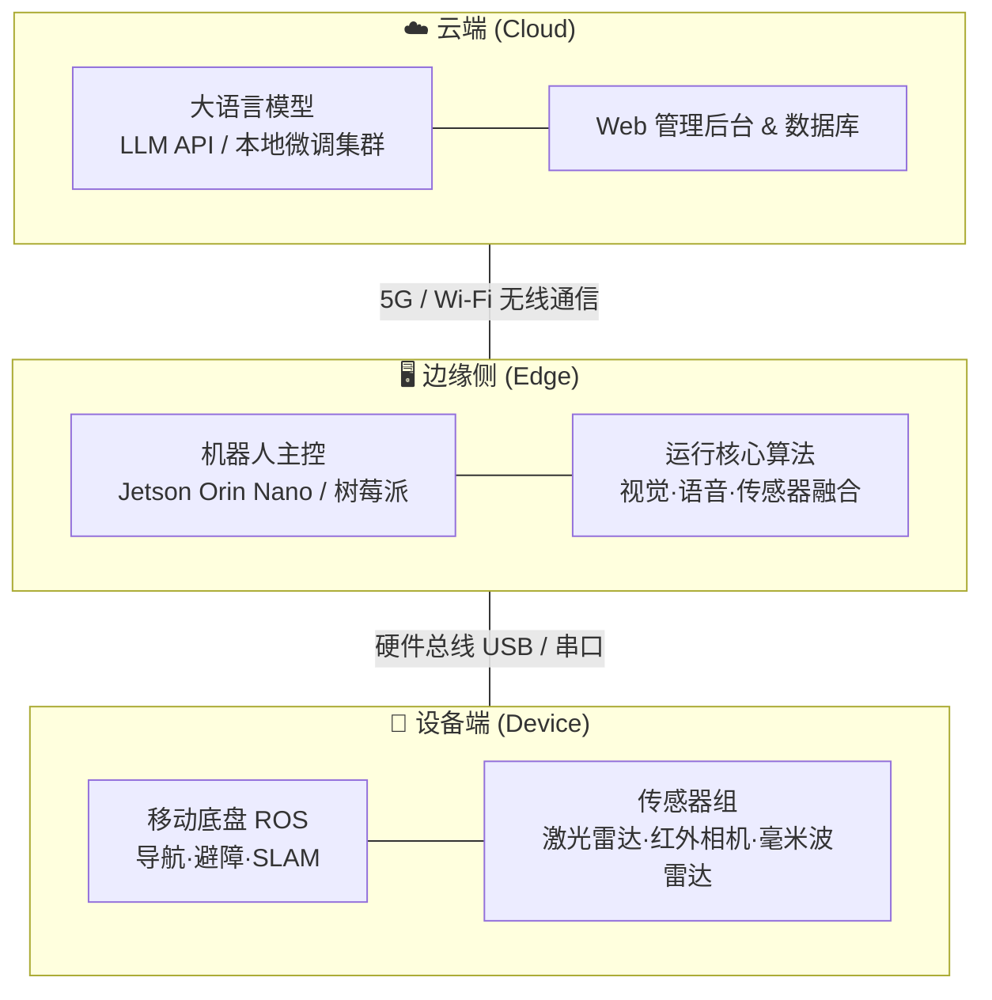

# 基于多模态大语言模型与边缘感知的一体化智能养老陪护巡逻系统

> **项目定位：** 聚焦养老院"白天情感陪护"与"夜间安全巡逻"双重核心需求的智能机器人系统。

---

## 一、项目背景与研究意义

### 1. 项目背景

随着我国人口老龄化加剧，养老机构（养老院）面临巨大的运营压力。目前养老院存在两大核心痛点：

- **白天的精神空虚：** 护工配比严重不足，难以满足老人的情感慰藉需求，长期缺乏交流容易加速老人的认知功能衰退。
- **夜间的安全盲区：** 夜间是老年人突发疾病（如呼吸骤停）或意外跌倒的高发期。护工夜间巡逻存在时间间隔和视觉盲区，一旦错失"黄金救援时间"，极易酿成严重后果。

### 2. 研究意义

本项目旨在开发一款"日夜兼优"的智能养老服务机器人，通过技术手段辅助护工：

- **社会价值：** 填补老人的情感真空，提升生活质量；实现夜间全天候无死角监控，保障生命安全。
- **技术创新：** 将前沿的大语言模型（LLM）低延迟交互技术，与边缘侧（Edge Computing，即设备本地处理）的多模态感知、目标检测技术相融合，打造一套低成本、高可靠性的软硬件一体化解决方案。

---

## 二、系统总体架构

系统采用 **"云-边-端"** 一体化架构设计。机器人白天作为"情感陪护员"在固定区域或老人床边活动，夜间切换为"安防巡逻员"按规划路线进行自主巡检。

---

## 三、核心功能模块与技术栈

### 1. 核心功能模块

- **模块一：多模态情感交互系统（白天模式）** —— 实现语音唤醒、方言识别、自然语言理解与极具同理心的对话回应。具备"长短期记忆"，能记住老人的姓名、喜好和健康历史。
- **模块二：自主巡航与环境感知系统（通用基础）** —— 实现养老院室内的激光 SLAM 构建地图、自主路径规划、避障以及自动回充。
- **模块三：边缘侧夜间安防监测系统（夜间模式）** —— 在低照度（夜间）环境下，对老人进行非接触式健康监测，重点攻关人体跌倒姿态识别与基于生命体征（呼吸/心率）的异常状态告警。

### 2. 推荐技术栈

| 维度 | 推荐技术/工具 | 作用与说明 |
|------|--------------|-----------|
| 硬件与底盘 | ROS/ROS2 机器人底盘、激光雷达（LiDAR） | 负责机器人的移动、建图与导航基础 |
| 计算平台 | NVIDIA Jetson Orin Nano / 高性能笔记本 | 作为机器人的"本地大脑"，运行视觉与传感器算法 |
| 软件开发 | Python（主流）、C++（底盘控制） | 核心开发语言。Vibe coding |
| AI 交互 | DeepSeek / Qwen API + 提示词工程（Prompt） | 驱动情感对话，利用 RAG 赋予机器人长记忆 |
| 语音语义 | 百度语音 / 科大讯飞 ASR & TTS SDK | 实现"听得准（语音识别）"与"说得好（语音合成）" |
| 视觉与感知 | YOLOv8-pose / MediaPipe、毫米波雷达数据流 | 用于夜间骨骼关键点跌倒检测及非接触式体征捕捉 |

---

## 四、两大研究方向与核心任务

### 🔹 方向一："智能交互与云端大脑"（偏向软件与 AI 应用）

**核心任务：**

1. **语音交互流水线搭建：** 对接 ASR（语音识别）和 TTS（语音合成），优化"语音进 → 文字出 → 大模型处理 → 语音播报"的整体响应延迟（目标控制在 2 秒内）。
2. **情感陪护知识库构建：** 学习使用 Prompt Engineering（提示词工程），为大模型设定"温柔、耐心的专业护工"角色；利用轻量级数据库搭建 RAG 系统（搭建每个老人的专属智能体？搭建情感陪护的知识图谱？），让机器人具备长记忆。
3. **上层业务逻辑开发：** 编写陪护模式与巡逻模式的切换逻辑，开发微信小程序或后台告警模块（当收到学生 B 的报警信号时，自动向护工推送消息）。

### 🔹 方向二："边缘感知与夜间安防"（偏向硬件、视觉与算法）

**核心任务：**

1. **移动底盘与导航调试：** 掌握 ROS 系统的基本使用，实现小车在模拟养老院环境下的 SLAM（即时定位与地图构建）建图、自主导航和安全避障。
2. **低照度跌倒检测算法：** 负责红外夜视相机的图像采集，部署并优化 YOLOv8-pose 算法。通过实时提取人体骨骼关键点，结合速度、角度等时空特征，准确识别"意外跌倒"并剔除"正常躺卧"等误报。
3. **多源感知融合（进阶）：** 尝试接入毫米波雷达，读取老人夜间睡眠时的微动数据，协同判断是否存在呼吸异常或骤停风险。一旦触发异常，立即向系统发送告警触发信号。

---

## 五、预期成果

- **🛠 硬件原型：** 1 台具备自主导航、语音互动、夜视监控功能的软硬件一体化机器人样机。
- **💻 软件成果：** 1 套多模态交互系统源码及后台告警微信通知系统（可申请软件著作权和专利）。
- **📄 创新提炼：** 提炼 1~2 篇关于"大模型轻量化部署"或"大模型在老龄陪护中的提示词策略"的学术论文。

---

## 六、开发策略

> **"模块化开发、逐步集成"** 的策略，先熟悉各自领域的开源工具，后续有师兄会与你们对接（**邓云师兄**）。
