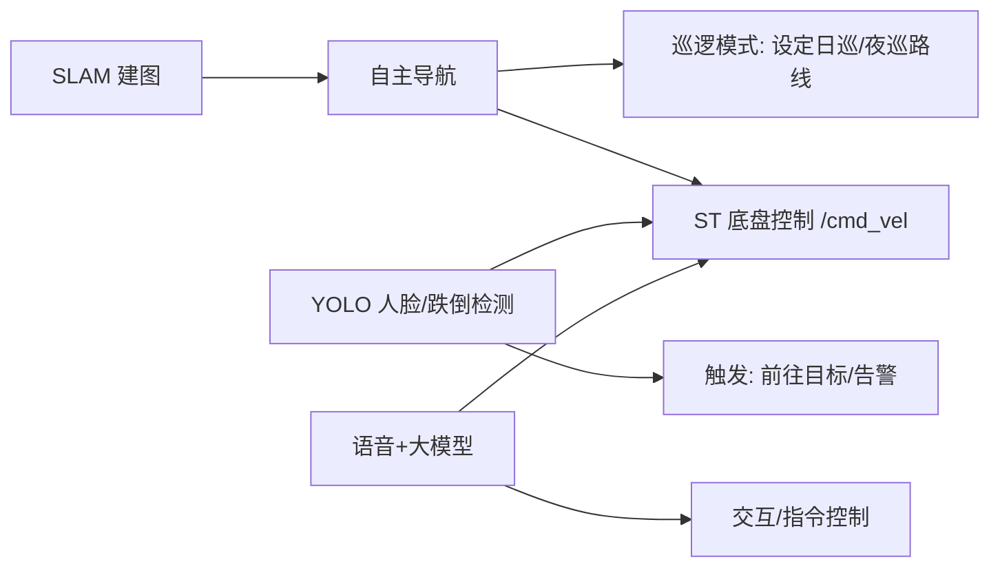

# ROS2 SLAM 小车实战教程（从零到自主导航）

> 这不是一本"概念手册"，而是一份**跟着做就能跑起来**的实战教程。
> 目标是：**让你在电脑上做出一辆能自己建地图、自己找路走的小车（仿真版）**。
> 我们不做 Turtlesim 小乌龟，直接做一辆真实的机器人模型小车。

---

## 这份教程怎么用？

| 传统教程的做法 | 本教程的做法 |
|--------------|------------|
| 先花 10 章讲概念，最后才碰仿真 | **每一步都在做小车**，概念遇到再讲 |
| Rviz / SLAM 一笔带过 | SLAM 建图、导航是**最终大目标**，详细展开 |
| 学完不知道怎么用 | 每一步都有一个**能看到的效果** |

**路线总览（6 大步）：**

```
第 1 步：搭好环境（WSL2 + ROS2 Humble）
第 2 步：让一辆现成的仿真小车"动起来"          ← 第一次接触节点/话题/ros2 命令
第 3 步：用键盘控制小车 + 用 Rviz 看传感器      ← 理解数据流、TF、URDF
第 4 步：【核心】给小车装 SLAM，让它自己建地图  ← 理解 SLAM 原理 + slam_toolbox
第 5 步：【核心】保存地图，让它自主导航        ← 理解 Navigation2、AMCL、代价地图
第 6 步：自己写节点（Python）+ 自定义接口      ← 从"会用"走向"会写"
```

> 💡 **心理准备：** 你会一遍遍地跟"找不到包""话题没数据""没报错但不工作"斗争——这**很正常**，第 X 章有专门的排坑清单。机器人入门 80% 的时间都在调试。

---

# 第 1 步：搭好环境（WSL2 + ROS2 Humble）

你的情况：**Windows 实体机，想在 WSL2 里学仿真**。这是一个可行的方案，但有几个坑要先踩平。

## 1.1 为什么用 WSL2？有什么坑？

**WSL2（Windows Subsystem for Linux 2）** 是在 Windows 里跑的一个轻量 Linux。优点是不用装虚拟机、切换方便。

**但对 3D 仿真有两个重要提醒：**

| 项目 | 情况 |
|------|------|
| 命令行 / ROS2 / Python / 建图地图 | ✅ 完全没问题 |
| Gazebo 3D 画面 / Rviz 3D 界面 | ⚠️ 能用，但**可能卡顿**，取决于显卡 |
| 图形界面 | 需要 **WSLg**（Windows 11 自带，Windows 10 需升级到最新版） |

> 🔥 **先说结论：** 如果后面仿真卡得没法用，别硬扛——用双系统装 Ubuntu 22.04 是更稳的路线。但先按下面的方法试试，多数电脑够用。

## 1.2 检查你的 Windows 版本和 WSL

用管理员 PowerShell 执行：

```powershell
# 1. 查看 Windows 版本（WSLg 需要 Win10 21H2+ 或 Win11）
winver

# 2. 安装 WSL2（会自动装 Ubuntu，默认最新版）
wsl --install

# 3. 安装完成后重启电脑
```

重启后打开"Ubuntu"应用，会让你创建 Linux 用户名和密码（记住密码，sudo 要用）。

## 1.3 关键坑①：WSL2 默认装的是 Ubuntu 24.04，但我们要 22.04

`wsl --install` 默认装 Ubuntu 最新版（24.04），可 ROS2 Humble 需要 **Ubuntu 22.04**。

**推荐做法：安装指定的 Ubuntu 22.04 发行版：**

```powershell
# PowerShell 中查看可用的发行版
wsl --list --online

# 安装 Ubuntu-22.04（对应 ROS2 Humble）
wsl --install -d Ubuntu-22.04
```

> 如果已经装了 24.04，想换也简单：PowerShell 里 `wsl --unregister <名字>` 卸载后重新装 22.04 即可（会清空里面的数据，注意备份）。

## 1.4 进入 WSL2 并更新系统

打开"Ubuntu 22.04"应用，进入 Linux 终端：

```bash
# 看到用户名和路径，说明成功。先更新软件源
sudo apt update
sudo apt upgrade -y
```

> 🖥️ **WSLg 验证：** 在终端输入 `echo $DISPLAY`，如果能看到 `:0`，说明图形界面 OK（Rviz 能弹窗）。看不到也别慌，第 2 步有个折中方案。

## 1.5 安装 ROS2 Humble

逐条执行（这是 ROS 官方推荐步骤）：

```bash
# 1. 设置 UTF-8 编码
sudo apt update && sudo apt install locales
sudo locale-gen en_US en_US.UTF-8
sudo update-locale LC_ALL=en_US.UTF-8 LANG=en_US.UTF-8

# 2. 添加 ROS2 软件源
sudo apt install software-properties-common -y
sudo add-apt-repository universe -y
sudo apt update && sudo apt install curl -y
sudo curl -sSL https://raw.githubusercontent.com/ros/rosdistro/master/ros.key -o /usr/share/keyrings/ros-archive-keyring.gpg
echo "deb [arch=$(dpkg --print-architecture) signed-by=/usr/share/keyrings/ros-archive-keyring.gpg] http://packages.ros.org/ros2/ubuntu $(. /etc/os-release && echo $UBUNTU_CODENAME) main" | sudo tee /etc/apt/sources.list.d/ros2.list > /dev/null

# 3. 安装 ROS2（桌面版含 Rviz，务必选这个）
sudo apt update
sudo apt install ros-humble-desktop python3-colcon-common-extensions -y
```

安装可能要 10~20 分钟，耐心等。

## 1.6 配置环境（自动加载）

每次开终端都要 source 太麻烦，配置成自动加载：

```bash
echo "source /opt/ros/humble/setup.bash" >> ~/.bashrc
source ~/.bashrc

# 验证
ros2 --version
# 应该输出：ros2 <版本号>（类似 0.29.x）
```

## 1.7 安装本教程要用的小车仿真包

我们用的是一辆开源仿真小车 **TurtleBot3**（乌-龟-机-器-人），它是 Humble 下最成熟、文档最全的入门小车，自带激光雷达和 SLAM 支持。

```bash
# 安装 TurtleBot3 仿真要用到的所有包
sudo apt install ros-humble-turtlebot3-gazebo \
                 ros-humble-turtlebot3-simulations \
                 ros-humble-turtlebot3-teleop \
                 ros-humble-slam-toolbox \
                 ros-humble-navigation2 \
                 ros-humble-nav2-bringup \
                 ros-humble-cartographer \
                 ros-humble-cartographer-ros -y
```

> 这一条命令就把"仿真小车 + 键盘遥控 + 建图 + 导航"全装齐了。后面我们缺什么再补装。

## ✅ 第 1 步验收

```bash
ros2 --version          # 有版本号
echo $DISPLAY           # 有 :0（图形界面）
```

两个都有输出，说明环境 OK，进入第 2 步。

---

# 第 2 步：让仿真小车"动起来"

这一章你会第一次真正"开"一辆车。做完你会有两三个终端同时在跑——别慌，这正是 ROS2 的日常工作方式。

## 2.1 认识三个要害：节点、话题、命令

在动手前，先只讲三个你马上会碰到的词，够用就行：

**① 节点（Node）**
> 一个正在运行的程序，负责一件具体的事。比如"读雷达的节点""算里程的节点""控制键盘的节点"。
> 一辆车 = 一堆节点各干各的，互相通信。

**② 话题（Topic）**
> 节点之间"广播消息"的通道。比如雷达节点把扫描数据**发布**到 `/scan` 这个话题，谁想用就去**订阅**。
> 广播的特点：发布者不管有没有人听，订阅者想听就听。

**③ ros2 命令**
> 你在终端敲的命令，用来查看和管理这一切。`ros2` 是总前缀，后面跟 `node` / `topic` / `run` 等。
> 一个节点 = 一个终端窗口（进程），这是 ROS2 最简单也最常用的跑法。

## 2.2 第一步：把车在 Gazebo 仿真世界里"造"出来

先开**终端①**，设置小车型号并启动 Gazebo 仿真：

```bash
# 让 TurtleBot3 相关包知道要用哪个型号的小车（burger 是最小款的）
export TURTLEBOT3_MODEL=burger

# 在 Gazebo 里启动小车（会弹出一个 3D 世界窗口，里面有一辆小车）
ros2 launch turtlebot3_gazebo turtlebot3_world.launch.py
```

> 🔥 **如果弹不出 Gazebo 窗口（WSLg 问题常见）：**
> 3D 仿真在 WSL2 里有时显示不出来，但**小车其实已经在跑了**——不影响后面学建图。
> 先继续往下做，第 3 步 Rviz 窗口如果出不来，我们再专门处理显示问题。

**看到的效果：** 一个带围墙的房间里，有一辆圆盘状的小车（burger），上面竖着一根圆柱就是激光雷达。

> 🧠 **我们做了什么？** 这一条命令其实启动了**很多个节点同时工作**：驱动小车的、发雷达数据的、算里程计的……它们通过话题互相连接，共同构成了"一辆能感知的小车"。这就是为什么 ROS2 一个 launch 就能开一大堆东西。

## 2.3 第二步：检查这辆车"活着"没有

新开**终端②**，用 ros2 命令"体检"：

```bash
# 列出所有正在运行的节点（程序）
ros2 node list
# 会看到类似：/gazebo、/robot_state_publisher、/scan 相关的一堆

# 列出所有话题（数据通道）
ros2 topic list
# 重点看这几个：
#   /scan          ← 激光雷达扫描数据
#   /odom          ← 里程计（车走了多远）
#   /cmd_vel       ← 速度控制指令（让车动的"油门"）
```

**先记住这三个话题**，它们是后面所有操作的核心。

再实时看一下雷达数据长啥样：

```bash
# 订阅 /scan 话题，把数据打出来（按 Ctrl+C 停止）
ros2 topic echo /scan
```

你会看到一堆数字按固定频率刷新——这就是激光雷达测到的周围障碍物距离。**数据一直在流，说明车"活着"。** 按 Ctrl+C 退出。

## 2.4 第三步：用键盘把小车开起来

新开**终端③**，运行键盘遥控节点：

```bash
export TURTLEBOT3_MODEL=burger
ros2 run turtlebot3_teleop turtlebot3_teleop_key
```

**看到的效果：** 终端里会出现一张按键盘方向键（wasd/x）控制小车的说明。按住 `w`/`s` 前进后退，`a`/`d` 转向。

**同时去 Gazebo 窗口看：** 小车动了！它真的在撞墙、转弯。

> 🧠 **我们做了什么？** 键盘节点把键盘按键转成**速度指令**，发布到 `/cmd_vel` 话题；小车的底盘节点订阅了 `/cmd_vel`，收到指令就驱动轮子。**"发布-订阅"就是刚才第 2.1 节说的"话题"，你现在亲手体会到了。**

## 2.5 停下来，理解"我们刚才干了啥"

你现在有 3 个终端同时在跑，它们是**三个独立进程**，通过 ros2 的通信网络互相说话：

```
终端③ 键盘节点 ──(按键→速度)──▶ /cmd_vel 话题 ──▶ 小车底盘节点  ──▶ Gazebo里的车
                              /scan 话题 ◀── 雷达驱动节点 ◀── Gazebo里的激光雷达
```

**关键认知（重要）：**
1. **每个终端 = 一个独立程序 = 一个节点**，谁都不"调用"谁，只通过话题说话。
2. **同一个话题谁都能订阅**，所以第 2.3 节的 `ros2 topic echo` 能"偷听"到雷达数据，不影响小车运行。
3. 你不需要写任何代码，就能让一个完整的机器人系统跑起来——**ROS2 的精髓就是"组合现成的节点"**。

## ✅ 第 2 步验收

```bash
ros2 topic list          # 能看到 /scan、/odom、/cmd_vel
ros2 topic echo /scan    # 雷达数据在流
```

+ 键盘能控制小车在 Gazebo 里移动。

**做到了这三件事，你已经有"一辆能开、能感知的小车"了。** 下一步我们装上"眼睛"（Rviz），学会看它看到的世界。

---

# 第 3 步：给小车装"眼睛"（Rviz）——理解数据流、TF 和 URDF

上一章你"感觉"到小车在动，但没"看到"它感知到的世界。这一章我们用 **Rviz**（ROS2 的 3D 可视化工具）把车的内部世界变成画面。做完你会真正理解"数据流"长什么样。

## 3.1 Rviz 是什么？

**Rviz = ROS Visualization**，是一个 3D 查看器，专门用来**"看到"话题里的数据**：雷达扫描、里程计、地图、机器人模型……它不参与控制，只是"画面"，相当于机器的行车记录仪 + 仪表盘。

## 3.2 打开 Rviz 看看小车的世界

假设终端①（Gazebo）和终端③（键盘）还在跑。新开**终端④**：

```bash
rviz2
```

会弹出一个界面（如果 WSL 下出不来，参考第 7 章的显示排坑）。

**刚打开是空的**，需要自己"加显示项"。在左下角点 **Add**（添加）→ 选 **By topic**（按话题）→ 你会看到一系列可显示的数据：

| 要显示什么 | 在 Add 里选 | 说明 |
|-----------|------------|------|
| 车的激光雷达轮廓 | `LaserScan` → `/scan` | 一圈红色点就是雷达扫到的墙 |
| 点在机器人上的位置 | `TF` → `/tf` | 显示车的坐标系骨架和"前进方向箭头" |
| 小车 3D 模型 | `RobotModel` → 会自动加载 URDF | 完整的车 |

**添加后你会看到：** 一圈红色/彩色点阵（雷达扫到围墙的点）+ 车的坐标骨架。**转动键盘控制小车，雷达点阵会跟着实时变化**——这就是小车"眼睛"看到的障碍物。

> 🧠 **我们做了什么？** Rviz 其实就是一个**订阅了很多话题的节点**。它订阅 `/scan` 拿到雷达数据、订阅 `/tf` 拿到位置关系……然后画出来。**你又一次体会了"订阅话题 = 获取数据"。**

## 3.3 三个你必须懂的概念（现在讲刚好）

### ① 数据流（Data Flow）
小车系统里所有信息都是"流"：雷达 10 次/秒刷新、里程计刷新、速度指令刷新。**Rviz 就是这些流的一个"可视化出口"。**

```
雷达 → /scan      ──▶ Rviz（画点阵）+ SLAM（后面用）
里程计 → /odom    ──▶ Rviz（画轨迹）+ 导航（后面用）
速度 → /cmd_vel   ◀── 键盘（你手动发）
```

### ② TF（坐标变换）——管"车在哪里，部件在哪里"
小车有多个"坐标系"：`base_link`（车中心）、`base_scan`（雷达位置）、`odom`（起点）……TF 就是记录这些坐标系之间相对位置关系的系统。

**关键作用：** 雷达测的距离是"相对雷达自己的"，要转成"相对车的"、"相对地面的"，全靠 TF 换算。**做 SLAM 时 TF 是命脉，断了必炸。** 现在只要知道它是啥，后面会反复用到。

验证方式（在 Rviz 左侧 `Add → TF` 添加后能看到 axes），或命令行：

```bash
# 查看雷达坐标系相对于车中心的变换
ros2 run tf2_ros tf2_echo base_link base_scan
# 会不断输出两个坐标系间的平移量（雷达在车中心正上方一点）
```

### ③ URDF——描述"车长什么样"
**URDF（Unified Robot Description Format）** 是一份描述机器人的 XML 文件：几个轮子、雷达装哪、多大、什么颜色。Gazebo 靠它造出 3D 车，Rviz 靠它显示模型。

**你现在不需要写 URDF**（用的是 TurtleBot3 现成的），但要知道：**小车在电脑里的"身体"就是一份 URDF 文件**，改它能改车的长相和传感器布局。第 6 步我们会接触自己的简单 URDF。

## 3.4 用命令行"看到"数据（图像之外的方法）

不只看 Rviz，用命令也能确认数据在流动（这对排错极其重要）：

```bash
# 看 /odom 里程计数据（车的位置、速度）
ros2 topic echo /odom --once

# 看话题的数据更新频率（雷达通常 10Hz+）
ros2 topic hz /scan

# 看 /cmd_vel 当前指令（开键盘时会一直有新数据）
ros2 topic echo /cmd_vel
```

## ✅ 第 3 步验收

- [ ] Rviz 里能看到雷达点阵、车模型、TF 坐标轴
- [ ] 控制小车时，雷达点阵实时变化
- [ ] `ros2 topic hz /scan` 显示有频率（约 5~10 Hz）

**到这里，你有了：一辆能开的车 + 一双能看的眼睛。** 第一次让车"看见世界"了。

**再进一步（可选但推荐）：** 现在把终端③（键盘）Ctrl+C 关掉，只留 Gazebo + Rviz。因为第 4 步我们要让小车**自己建图**，不需要手动控制（键盘可以之后再开）。

---

# 第 4 步：【核心】让小车自己建地图（SLAM）

这是整个教程的重头戏。做完这一章，你会让小车**自己画出一张它探索过的地图**——这就是"智能小车"和"遥控小车"的分水岭。

## 4.1 SLAM 是什么？为什么它很神奇？

**SLAM = Simultaneous Localization And Mapping（同时定位与建图）**

拆开看：
- **建图（Mapping）**：小车用激光雷达把周围环境画成一张地图。
- **定位（Localization）**：小车要知道"我现在在地图的哪个位置"。

**难就难在"同时"：** 建图需要知道自己在哪（才能把新扫描拼到正确位置），定位又需要地图（才能对照出自己在哪）——**互相依赖，鸡生蛋蛋生鸡**。SLAM 算法的高明之处就是**一边猜自己位置、一边修正地图，不断迭代收敛**。

> 🧠 **现实类比：** 你蒙着眼走进一个陌生房间，手里拿卷尺（激光雷达）量墙——你每走一步，先靠"我记得刚走了几步"（里程计）猜位置，再用手里的尺子量出周围墙的位置画下来，画的图又能反过来校准"我到底在哪"。**这就是 SLAM。**

## 4.2 SLAM 需要哪些输入？产出什么？

```
输入：
  /scan       ← 激光雷达扫描（小车"看"到的墙）
  /odom      ← 里程计（小车"感觉"自己走了多远）
  TF         ← 各部件坐标关系

SLAM 算法（slam_toolbox 节点）
  ↓
输出：
  /map       ← 一张地图（将来保存成文件）
  更新后的 TF ← 小车在地图里的实时位置
```

**你什么都不用写**——ROS2 提供了现成的 SLAM 节点。你的任务是：**启动它，然后开车把房间逛一遍**，它就边逛边画地图。

## 4.3 打开一个 SLAM 建图（关键配置）

先确保**终端①**（Gazebo 小车）在跑。

> 🔥 **建图前记一条铁律：** 建图过程中**每开一个终端都要先 `export TURTLEBOT3_MODEL=burger`**，不然会报"找不到模型"错。下面每个新终端我都会写上这条。

**终端②** 启动 SLAM 建图：

```bash
export TURTLEBOT3_MODEL=burger
ros2 launch turtlebot3_slam turtlebot3_slam.launch.py
```

这条命令会自动打开 **SLAM Toolbox + Rviz（带地图显示）**。
- 如果 Rviz 弹出来了，会看到一个灰色区域——**这就是"还没画的空白地图"**。
- 地图坐标系 `map` 也出现了。

**终端③** 启动键盘控制器：

```bash
export TURTLEBOT3_MODEL=burger
ros2 run turtlebot3_teleop turtlebot3_teleop_key
```

## 4.4 开始逛房间（建图过程）

用键盘**慢慢**开着小车把房间逛一圈。**技巧：**

- **速度慢一点**（按小写 w/s，别按大写），转弯尤其要慢，SLAM 跟不上太快会花图。
- 沿墙走，让每个角落都被雷达扫到。
- 回到起点附近时，会发现地图格外清晰——**这正好印证了 SLAM 的"闭环"矫正**（走到熟悉的地方，算法纠正前面的误差）。

**你会实时看到：** 灰色区域慢慢被"涂"黑色——黑色轮廓就是墙，白色是空地。**你亲手让机器人生成了一张地图！**

> 🧠 **意外收获：** 注意红色小点（雷达）和小车位置——SLAM 同时在**跟踪小车在地图里的位置**。地图越逛越全，位置也越跟越准。

## 4.5 地图建好了吗？——检查质量

逛完一圈，看图的几个信号：
- ✅ 墙是**连续的直线**，没有明显错位/重影
- ✅ 房间轮廓闭合（能看出完整房间形状）
- ✅ 没有因速度太快产生的"糊"的墙

如果墙有重影、错位：**这张图质量不高**。回到起点，在已画好的区域多停一下让它"闭环修正"，或重新慢慢逛。

## 4.6 保存地图（重要，别丢）

一张建好的图是宝贵的资产，导航要用。**终端④** 保存：

```bash
# 保存到当前目录，生成 my_map.pgm（图片）+ my_map.yaml（配置）
ros2 run nav2_map_server map_saver_cli -f ~/map/my_map
```

（`~/map/` 目录不存在会自动建，`my_map` 是文件名）

验证文件生成了：

```bash
ls ~/map/
# 应该有：my_map.pgm 和 my_map.yaml
```

> 🧠 **地图存成了什么？** `.pgm` 是图片（黑色=墙，白色=空地，灰色=未知）；`.yaml` 是配套说明（地图分辨率、原点位置、占用阈值等）。**`my_map.yaml` 将来导航时要喂给它。**

## ✅ 第 4 步验收

- [ ] Rviz 里出现一张完整的房间地图
- [ ] 墙清晰连续，无严重重影
- [ ] 已经用 `map_saver_cli` 保存成 `my_map.pgm` + `my_map.yaml`

**恭喜，这可能是全程最有成就感的一刻：你完成了"SLAM 建图"。**

先关掉建图相关终端（终端②③④，Gazebo 终端①可留可不留）。

---

# 第 5 步：【核心】保存地图，让小车自主导航

地图有了，但"会建图"和"会自己找路走"是两回事。这一章让小车**从任意地方自己规划路线走到你指定的目标点**——这是 SLAM 技术的终极应用场景。

## 5.1 自主导航要做什么？

"导航" = 三件事串起来：
1. **定位**：小车怎么知道自己在哪？→ 用**AMCL**（在地图里对比雷达和地图，算出位置）
2. **规划**：从 A 到 B 走哪条路？→ 用**全局规划器**（算出最优路径）
3. **避障**：路上突然有东西怎么办？→ 用**局部规划器 + 代价地图**（实时绕开）

```
              ┌────────── SLAM 建图阶段 产出的 ──────────┐
  新建世界     │   my_map.yaml + my_map.pgm（地图文件）     │
              └──────────────────────────────────────────┘
                                       │
   雷达 /scan ─┬─▶ AMCL 定位  ──▶ "我在哪"                  │
   里程计 /odom┘        │                                  │
                        ▼                                  │
        导航栈 Nav2  （全局规划 + 局部规划 + 代价地图）        │
                        │                                  │
                        ▼                                  │
                   /cmd_vel 速度指令 ──▶ 小车动起来           │
                                                          │
    （整个后半段都是"消费"第 4 步建的那张地图）      ◀────────┘
```

## 5.2 重启一辆新车

**终端①** 启动 Gazebo（如果被关了）：

```bash
export TURTLEBOT3_MODEL=burger
ros2 launch turtlebot3_gazebo turtlebot3_world.launch.py
```

> 🧠 **注意：** 这次启动的小车**不知道自己在哪，也没有地图**——它是个"失忆"的新车。导航的第一步就是先让它"想起"自己在地图的哪个位置（定位）。

## 5.3 让小车"认出自己在地图哪"（定位 + 导航一起启动）

**终端②** 启动 Nav2 导航栈（带地图 + AMCL 定位 + Rviz）：

```bash
export TURTLEBOT3_MODEL=burger

# 用第 4 步存的地图做导航初始化
ros2 launch turtlebot3_navigation2 turtlebot3_navigation2.launch.py \
  map:=~/map/my_map.yaml
```

弹出的 Rviz 里你会看到：
- 房间地图（第 4 步画的）
- 一堆**绿色箭头**（粒子）。这是 **AMCL** 在"撒粒子"——**每个绿色箭头是"小车可能所在位置的一个猜测"**。雷达数据一进来，发散的位置会快速收敛到一处。

因为 Gazebo 里小车**随机生成位置**，AMCL 一开始可能"猜错"。不用慌，手动给它一个初始猜测:

## 5.4 告诉小车"你大概在这"（2D Pose Estimate）

1. 在 Rviz 顶部点 **2D Pose Estimate** 按钮。
2. 在地图上**小车真实位置附近**（看 Gazebo 里车在哪）按下鼠标，**拖出一个箭头**，指向车头的朝向，松开。

这样 AMCL 会先按你给的估计跑，雷达一比对就快速收敛到真实位置。

**验证定位成功：** 看 Rviz 里的绿色粒子**聚成一团**，且和 Gazebo 里小车真实位置一致。若粒子漂移/发散，重新设一次 Pose Estimate。

## 5.5 下达"走到这里"的命令（2D Goal Pose）

1. 点 Rviz 顶部的 **2D Goal Pose** 按钮。
2. 在地图**任意空地**点一下，拖出箭头表示目标朝向，松开。

**看效果：**
- Rviz 会出现一条**蓝色线**=全局规划的最优路径
- 小车自动转向、沿着路径开过去
- 沿途有墙/障碍时，绿色局部轨迹实时调整绕开
- 到达目标后停下

**再试：** 换一个更远的目标点、甚至隔着墙的目标（小车会规划绕路）。**这就是自主导航。**

## 5.6 理解代价地图（为什么要"绕路"）

你可能注意到，小车不会贴着墙走，会留一点距离——因为地图像棋盘一样被标了"代价"：
- **致命代价（红）**：墙/障碍物，绝对不能进
- **膨胀代价（渐变色）**：靠近墙的区域，能不进就不进
- **无代价（白）**：随便走

这就是为什么小车"看着像避险"。**代价地图分全局和局部两张**，全局管"大方向上怎么走最优"，局部管"眼前几米实时躲障碍"。

## ✅ 第 5 步验收

- [ ] Rviz 地图加载成功，AMCL 粒子收敛到小车真实位置
- [ ] 设置目标点后，小车自动规划路径并成功到达
- [ ] 中途设障碍（可选：在 Gazebo 里加个墙）小车能绕开

**到了这里，你完成了一辆"能建图、能自己找路"的仿真小车——SLAM 小车最核心的两大能力你都有了。**

---

# 第 6 步：自己写节点（Python）+ 自定义接口

前面全是"组合现成的节点"。这一章你**自己造一个节点**，并给它**自定义一种消息**——从"会用"升级到"会写"。这也将是你以后往小车里加"属于自己的功能"（比如人脸识别、语音）的起点。

## 6.1 我们要做个什么？

做一个**"速度监视器"节点**：订阅小车的 `/cmd_vel`（速度指令），每收到一次就打印"当前速度是多少"。本质和 `ros2 topic echo` 一样，但**重在自己写一遍**，体会"一个节点从代码到跑起来"的完整过程。

顺便，我们定义一个**自定义消息** `RobotStatus`（机器人状态：名字、电量、位置），为将来扩展铺路。

## 6.2 建立工作空间和包

ROS2 里代码的组织方式是：**工作空间(workspace) → 包(package)**。

```bash
# 工作空间：装代码的"项目文件夹"
mkdir -p ~/ros2_ws/src
cd ~/ros2_ws/src

# 创建 Python 功能包 my_robot
ros2 pkg create my_robot --build-type ament_python \
  --dependencies rclpy geometry_msgs
```

**创建后的结构：**
```
~/ros2_ws/src/my_robot/
├── package.xml        # 包的介绍（名字、依赖）
├── setup.py           # 打包脚本（入口配置在这改）
├── setup.cfg
└── my_robot/          # 你的 Python 代码放这
    └── __init__.py
```

> 🧠 **"包"是什么？** 一个可复用、可安装、可 `ros2 run` 的功能单元。你以后每写一个功能模块就建一个包。

> ⚠️ **写 ROS2 代码必读（邮箱坑）**：`ros2 pkg create` 生成的 `package.xml` 里，`<maintainer>` 标签默认填的是 `ros2@localhost`，**`localhost` 不是邮箱**，`colcon build` 编译会报错。每次建包后都要把邮箱改成真实邮箱，统一写 **`sunrise@example.com`**，**不要写 `sunrise@localhost`**：
> ```xml
> <!-- package.xml -->
> <maintainer email="sunrise@example.com">sunrise</maintainer>
> ```

## 6.3 写第一个节点（速度监视器）

创建文件 `~/ros2_ws/src/my_robot/my_robot/velocity_monitor.py`：

```python
#!/usr/bin/env python3
import rclpy
from rclpy.node import Node
from geometry_msgs.msg import Twist  # cmd_vel 用的消息类型


class VelocityMonitor(Node):
    """订阅 cmd_vel，打印小车的线速度/角速度"""

    def __init__(self):
        # 节点名（ros2 node list 里看到的名字）
        super().__init__('velocity_monitor')

        # 创建订阅者：订阅 /cmd_vel，收到就调用 self.cb
        #   Twist        ← 消息类型
        #   '/cmd_vel'   ← 话题名
        #   self.cb      ← 回调函数（核心！）
        self.sub = self.create_subscription(
            Twist, '/cmd_vel', self.cb, 10)
        self.get_logger().info('速度监视器已启动')

    def cb(self, msg):
        """收到一条 cmd_vel 就执行一次——这是"事件驱动"的写法"""
        self.get_logger().info(
            f'线速度={msg.linear.x:.2f} m/s, '
            f'角速度={msg.angular.z:.2f} rad/s')


def main(args=None):
    rclpy.init(args=args)      # 初始化 ROS2
    node = VelocityMonitor()   # 创建节点对象
    rclpy.spin(node)           # 让节点一直"挂着"等消息（阻塞）
    node.destroy_node()        # 退出时清理
    rclpy.shutdown()


if __name__ == '__main__':
    main()
```

**先看看代码里的两个关键点（这是 ROS2 节点最重要的模式）：**
1. **`self.create_subscription(...)`**——注册一个订阅，参数是"消息类型 + 话题名 + 回调函数"。
2. **`self.cb(msg)`**——回调函数。**ros2 的编程模型是"事件驱动"**：平时什么都不做（`rclpy.spin` 挂着），一有消息就自动触发 `cb`。这种"有事叫我"的写法贯穿所有 ROS2 编程。

## 6.4 让这个节点能被 `ros2 run` 调用

编辑 `~/ros2_ws/src/my_robot/setup.py`，找到 `entry_points` 部分改成：

```python
    entry_points={
        'console_scripts': [
            'velocity_monitor = my_robot.velocity_monitor:main',
        ],
    },
```

> 这行的格式是 `'命令名 = 模块路径:函数名'`。这样 `ros2 run my_robot velocity_monitor` 就能启动它了。

## 6.5 编译并运行你的第一个节点

```bash
cd ~/ros2_ws
colcon build --packages-select my_robot
source install/setup.bash

# 运行你的节点（新终端，且记得 export TURTLEBOT3_MODEL=burger）
ros2 run my_robot velocity_monitor
```

**同时开键盘控制小车**（`ros2 run turtlebot3_teleop turtlebot3_teleop_key`），你会发现：**每次按方向键，速度监视器就打印出一条速度**——因为键盘节点发布 `/cmd_vel`，你的节点订阅到了。

> 🧠 **这就是你写的第一个 ROS2 节点！** 它和系统自带的节点（如键盘）完美通信，说明你真正理解了"发布-订阅"。

## 6.6 进阶：自定义消息接口 RobotStatus

光订阅现成的消息还不过瘾。我们来定义**自己的消息类型**，让小车发布自己的"名字、电量、位置"。

### ① 创建一个"接口包"（专门放自定义消息）

```bash
cd ~/ros2_ws/src
ros2 pkg create my_interfaces --build-type ament_cmake --dependencies std_msgs
```

### ② 定义消息内容

创建目录和文件：

```bash
mkdir -p ~/ros2_ws/src/my_interfaces/msg
```

创建 `~/ros2_ws/src/my_interfaces/msg/RobotStatus.msg`，内容：

```msg
# 机器人状态消息（自定义）
string robot_name            # 名字
float32 battery_percent      # 电量 0~100
float32 x                    # 地图中的 x 坐标
float32 y                    # 地图中的 y 坐标
float32 heading              # 朝向（弧度）
bool is_charging             # 是否在充电
uint8 mode                   # 0=手动, 1=建图, 2=导航, 3=巡逻
```

### ③ 让 CMake 认识这个 .msg

编辑 `~/ros2_ws/src/my_interfaces/CMakeLists.txt`，找到 `rosidl_generate_interfaces` 区域，改成：

```cmake
rosidl_generate_interfaces(${PROJECT_NAME}
  "msg/RobotStatus.msg"
  DEPENDENCIES std_msgs
)
```

### ④ 编译接口包

```bash
cd ~/ros2_ws
colcon build --packages-select my_interfaces
source install/setup.bash

# 验证自定义消息生成了（能打印出字段说明）
ros2 interface show my_interfaces/msg/RobotStatus
```

### ⑤ 在你的包（my_robot）里用这个自定义消息

先给 `my_robot` 加依赖：编辑 `~/ros2_ws/src/my_robot/package.xml`，在 `<depend>` 区域加：

```xml
<depend>my_interfaces</depend>
```

再写一个发布节点 `~/ros2_ws/src/my_robot/my_robot/status_publisher.py`：

```python
#!/usr/bin/env python3
import rclpy
from rclpy.node import Node
from my_interfaces.msg import RobotStatus  # 你自定义的消息


class StatusPublisher(Node):
    def __init__(self):
        super().__init__('status_publisher')
        # 发布自定义消息类型到 /robot_status
        self.pub = self.create_publisher(RobotStatus, '/robot_status', 10)
        self.timer = self.create_timer(1.0, self.cb)  # 每秒发布一次
        self.count = 0

    def cb(self):
        msg = RobotStatus()          # 创建自定义消息对象
        msg.robot_name = 'my_bot'
        msg.battery_percent = 99.0
        msg.x = 1.23
        msg.y = 4.56
        msg.heading = 0.0
        msg.is_charging = False
        msg.mode = 2                # 导航模式
        self.pub.publish(msg)
        self.count += 1
        self.get_logger().info(f'发布状态 {self.count} 次')


def main(args=None):
    rclpy.init(args=args)
    node = StatusPublisher()
    rclpy.spin(node)


if __name__ == '__main__':
    main()
```

同时给 `setup.py` 的 `entry_points` 加上：

```python
    entry_points={
        'console_scripts': [
            'velocity_monitor = my_robot.velocity_monitor:main',
            'status_publisher = my_robot.status_publisher:main',
        ],
    },
```

编译并跑：

```bash
cd ~/ros2_ws
colcon build --packages-select my_robot
source install/setup.bash

# 终端A：发布自定义状态
ros2 run my_robot status_publisher

# 终端B：订阅看数据
ros2 topic echo /robot_status
```

你会看到**你自己定义的那种消息**在话题里流动了。

## 6.7 至此你掌握了什么？

| 能力 | 说明 |
|------|------|
| 建包、写节点 | `ros2 pkg create` + 继承 `Node` |
| 订阅/发布 | `create_subscription` / `create_publisher` + 回调 |
| 自定义接口 | `.msg` 文件 → 编译 → 在代码里用 |
| 跑起来 | `colcon build` + `ros2 run` |

**这套"建包→写节点→自定义消息→编译运行"的流程，就是你以后往小车里加一切功能的模板**（加人脸识别、加语音、加巡逻逻辑，都是这么做）。

## ✅ 第 6 步验收

- [ ] `ros2 run my_robot velocity_monitor` 能打印 /cmd_vel
- [ ] 定义成功 `my_interfaces/msg/RobotStatus`
- [ ] 自定义消息在 `/robot_status` 话题发布、订阅成功

---

# 第 7 章：排坑清单 + 常见报错

下面是全程最常遇到的坑，遇到先来这里查。

## 7.1 显示问题（WSL2 没有窗口）

**症状：** Gazebo / Rviz 弹不出来或黑屏。
**排查：**
```bash
echo $DISPLAY        # 应该有 :0
ls /mnt/wslg/        # WSLg 相关，有文件说明 OK
```
**处理：**
- Windows 必须 Win11 或 Win10 21H2+。
- 确认已启用虚拟化（任务管理器→性能→虚拟化=已启用）。
- 重启 WSL：PowerShell 里 `wsl --shutdown` 再重新打开 Ubuntu。
- 若真不行：性能/显示问题严重时，建议换双系统 Ubuntu 22.04（SLAM 学习本身命令行能完成，但看地图方便很多）。

## 7.2 "找不到包 / Package not found"

**原因：** 没 source 工作空间，或没 `export TURTLEBOT3_MODEL`。
```bash
source /opt/ros/humble/setup.bash        # 如果没加到 bashrc
source ~/ros2_ws/install/setup.bash      # 你自己的包
export TURTLEBOT3_MODEL=burger           # TurtleBot 相关
```

## 7.3 话题没数据（ros2 topic echo 没输出）

按顺序查：
```bash
ros2 topic list                  # 话题存不存在？
ros2 topic type /scan            # 类型对不对？
ros2 topic hz /scan              # 有没有频率？（有=在发）
```
**常见原因：** 类型不匹配、订阅的 QoS（可靠性）不匹配、发布者没启动。

## 7.4 SLAM 图花了/重影

- 开太快 → 慢点开，转弯更慢
- 雷达歪/传感器问题 → 检查 TF
- 走回已画区域让"闭环"修正 → 回起点停一下

## 7.5 导航时小车不动 / 说没法规划

- **AMCL 粒子发散**（绿色箭头乱飞）→ 重新 2D Pose Estimate 设起点
- **地图加载失败** → 确认 `map:=` 路径写对，文件存在
- **代价地图全红/全黑** → 检查 /scan 是否有数据、TF 是否正常

## 7.6 TF 错误（最常见的连环杀手）

报错常形如 `Could not find transform` 或 Rviz 报 TF tree 断裂。
```bash
ros2 run tf2_tools view_frames.py   # 生成 tf 树图，看谁断了
```
**处理：** 缺 static transform 就补发、确认父/子关系正确、（建图时）确认 odom 在发。

## 7.7 ROS2 通用重启大法

搞不清啥错、越调越乱时：
```bash
pkill -9 ros2        # 杀掉所有 ros2 进程（终端里进程会退出）
# 然后重新 export + launch
```

---

# 结语 & 下一步

**你现在的仿真小车已经具备：**
- ✅ 驱动（键盘控制、速度和里程计）
- ✅ 感知（激光雷达 /scan、Rviz 可视化）
- ✅ **建图（SLAM / slam_toolbox）**
- ✅ **自主导航（Nav2 + AMCL + 代价地图）**
- ✅ 自己写节点 + 自定义消息（Python）

**把它接到你的《智能养老陪护巡逻机器人》项目：**



**可选的下一步（按兴趣挑）：**
1. **真车移植**：把 URDF/驱动换成你的真实底盘和激光雷达，SLAM/Nav2 逻辑基本复用。
2. **视觉 SLAM**：加摄像头（如 ORB-SLAM3 / RTAB-Map），体验纯视觉定位。
3. **巡逻任务**：写一个节点，给定一串目标点，让小车自动"巡逻"（这正是你项目的核心）。
4. **避障增强 / 传感器融合**：加超声波或摄像头做更鲁棒的避障。

**最后一句真心话：** 机器人学习没有"看完就会"，只有"跑完才会"。如果哪一步卡住了，多跑几遍、多看 `ros2 topic hz` 和 `ros2 node list` 这两把"调试之镜"，它们能告诉你好多真相。**动手吧，祝你早日让小车跑起来！** 🚗
