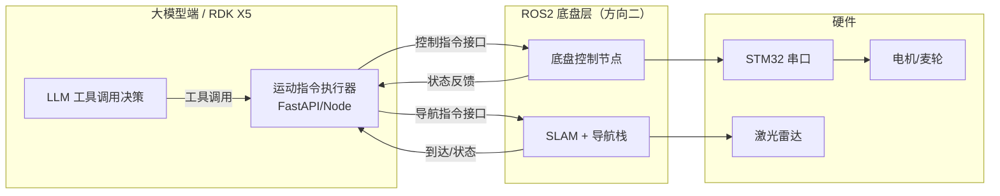

# ROS / 底盘接口需求（大模型端 → 方向二对接契约）

> **目的：** 大模型端需要控制小车移动/到点、读取小车状态。ROS2 / SLAM / 导航尚未开发，本文档先定义**接口契约**，作为大模型端与方向二（底盘/导航）的对接依据。
> **状态：** 契约草案，方向二开发时可调整；字段以最终 ROS 消息为准。
> **整理日期：** 2026-08-18

---

## 一、通信架构



> 大模型端不直接碰硬件，只通过 **ROS2 话题/服务** 与底盘层交互。开发期大模型端可用"模拟底盘"（收到指令打印/转发）先自测。

---

## 二、大模型端 → 底盘（控制指令，下行）

大模型端发出，ROS 底盘执行。

### 1. 直线 / 横移运动

| 项 | 内容 |
|----|------|
| 话题/服务 | 建议服务 `robot/move` |
| 请求字段 | `direction`（`forward` / `back` / `left` / `right`）、`distance_m`（米） |
| 行为 | 麦轮全向，可横移；到位自动停止 |
| 响应 | 成功/失败 + 实际是否到位 |

### 2. 原地转向

| 项 | 内容 |
|----|------|
| 话题/服务 | 建议服务 `robot/turn` |
| 请求字段 | `angle_deg`（度，正=左/负=右，约定待定） |
| 行为 | 原地旋转指定角度 |
| 响应 | 成功/失败 + 实际角度 |

### 3. 导航到点（需 SLAM，后置）

| 项 | 内容 |
|----|------|
| 话题/服务 | 建议服务 `robot/navigate_to` |
| 请求字段 | `place`（地点名，如 `客厅`/`卧室`/`门口`）或 `x`/`y`/`theta` |
| 依赖 | SLAM 建图 + 地点坐标表（见第四节） |
| 响应 | 成功/失败 + 是否到达 |

### 4. 停止 / 急停

| 项 | 内容 |
|----|------|
| 话题/服务 | 话题 `robot/cmd_stop`（高优先级，一收即停） |
| 触发 | 对话中老人喊停、安全校验失败、异常 |

---

## 三、底盘 → 大模型端（状态反馈，上行）

ROS 底盘发出，大模型端读取，用于判断"走到没、能不能走、还健不健康"。

| 数据 | 话题 | 字段 | 用途 |
|------|------|------|------|
| 里程计/位姿 | `odom` | `x, y, theta` | 判断是否到位 |
| 到达状态 | `robot/arrived` | `bool` + `place` | 导航完成确认 |
| 电量 | `robot/battery` | `percent` | 低电量告警/回充 |
| 障碍/碰撞 | `robot/obstacle` | `bool` + `distance` | 避障/急停兜底 |
| 执行状态 | `robot/exec_state` | `idle/ moving/ navigating / error` | 大模型判断小车当前在干嘛 |

---

## 四、地点语义化（导航后置）

让大模型说"去客厅"而 ROS 知道坐标，需要一张**地点表**：

```json
{
  "客厅":  { "x": 1.5, "y": 2.0, "theta": 0.0 },
  "卧室":  { "x": 3.2, "y": 0.8, "theta": 1.57 },
  "门口":  { "x": 0.0, "y": 0.0, "theta": 0.0 }
}
```

- 由方向二在 SLAM 建图后标注生成，大模型端只传**地点名**
- 未知地点 → 大模型端安全层直接拒绝，不问 ROS

---

## 五、大模型端侧的安全校验层（必做）

即使 ROS 端也有避障，大模型端仍要**前置校验**，防止大模型胡说：

1. 未知地点名 → 拒绝
2. `distance_m` / `angle_deg` 超上限 → 拒绝（如单次 ≤ 5m）
3. 老人正在对话中喊停 → 立即发 `robot/cmd_stop`
4. 电量过低 / 检测到障碍 → 拒绝移动并提示

---

## 六、开发期对接方式（ROS 未就绪时）

方向二未开发前，大模型端先做**模拟底盘**：

- 后端暴露同一套接口，内部用 mock（打印指令 + 假状态）
- 前端"工具调用日志"展示模拟的执行结果
- ROS 就绪后替换为真实 ROS 客户端，接口不变 → 无缝切换

---

## 七、开放问题（方向二需一起定）

1. 消息走 **ROS2 Service**（一问一答，适合 move/turn/navigate）还是 **Topic**（持续流，适合状态/急停）？建议：控制用 Service，状态与急停用 Topic。
2. `turn` 的角度正负约定？（左正右负 还是 逆时针正？）
3. 麦轮 `left/right` 横移，ROS 侧坐标如何映射到 `cmd_vel` 的 `linear.y`？
4. 地点表由谁维护、放哪个节点加载？
5. 急停优先级如何保证（是否由 STM32 硬件层直接接管，绕过 ROS）？

---

*本文档为接口契约草案，与方向二联调时迭代更新。*
