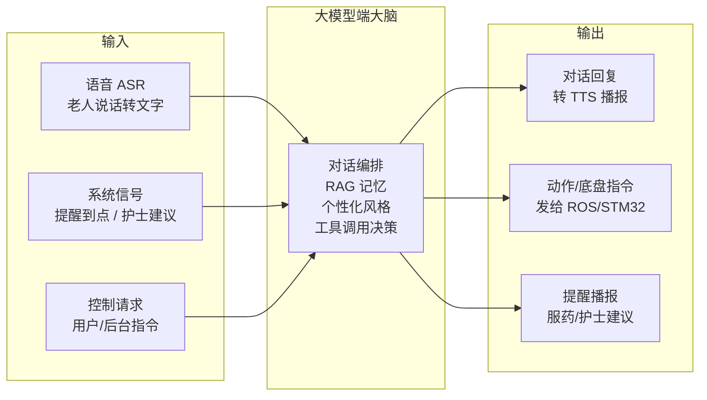
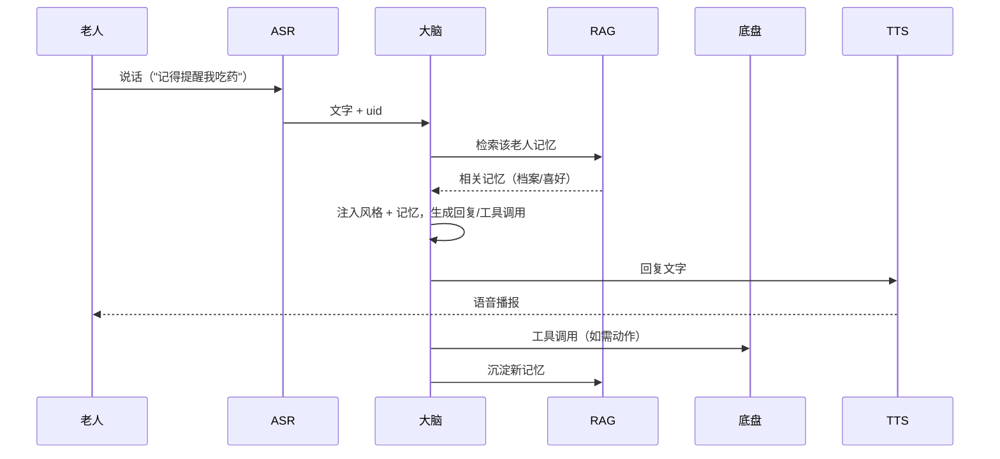

# 大模型端（智能交互与云端大脑）开发目标

> **对应方向：** 《基于多模态大语言模型与边缘感知的一体化智能养老陪护巡逻系统》——方向一"智能交互与云端大脑"
> **运行载体：** 地瓜派 RDK X5（地平线 RDK X5，本地大脑）为主，开发期可用高性能笔记本
> **文档性质：** 开发目标规划（二轮修订），供团队讨论细化
> **整理日期：** 2026-08-18（二轮修订同日：补充降级矩阵、并发开发要求、混合检索、语音本地化、工具仲裁等）
> **硬件参考：** RDK X5 板卡实测规格见 [`板卡硬件规格.md`](../板卡硬件规格.md)（2026-08-15 实测：8 核 A55 / 8GB / BPU 10TOPS / 本地 1.5B 模型仅 ~6.5 tok/s）

---

## 一、定位与职责

大模型端是机器人的"**大脑与嘴**"：负责听懂老人、想好怎么回、决定要不要动、到点提醒吃药。

它承接三路输入、产生三类输出：



一句话概括：**大模型端负责"听得懂、记得住、说得好、做得对、到点提"**。

---

## 二、核心能力总览

| # | 能力 | 一句话说明 | 优先级 |
|:-:|------|-----------|:------:|
| 1 | 情感陪护对话 | 与老人自然聊天，语气温柔耐心 | 🔴 高 |
| 2 | RAG 长期记忆 | 记住姓名、喜好、健康史，跨轮不遗忘 | 🔴 高 |
| 3 | 个性化说话风格 | 学习老人说话习惯，模仿其口吻 | 🟠 中 |
| 4 | 用户系统 | 每位老人独立档案，各自专属风格与记忆 | 🟠 中 |
| 5 | 小车行进 / 动作 | 听懂"过来/转圈/去客厅"并执行 | 🔴 高 |
| 6 | 护士建议传达 / 定时提醒 | 到点提醒服药、转达护士嘱咐 | 🔴 高 |
| 7 | 语音链路（支撑） | ASR 听 + TTS 说，端到端低延迟 | 🔴 高 |
| 8 | 简陋管理前端（支撑） | 演示/调试用，不追求美观 | 🟢 低 |
| 9 | 联网搜索 / 新闻 | 老人问新闻、主动聊时事与养生 | 🟠 中 |
| 10 | 主动交互 | 空闲时主动找话题、关心起居 | 🟠 中 |
| 11 | 报警模块（独立服务） | 开放端口收各模块告警，紧急传达护士 | 🔴 高 |

---

## 三、分模块详述

### 模块 1：情感陪护对话

**目标：** 老人说一句话 → 得到"像护工又像家人"的回应。

- 多轮对话（复用现有 `LLM/server.py` 的多轮 messages 机制）
- System Prompt 设定角色：温柔、耐心、专业的"AI 护工"；称呼老人、关心起居
- 可结合 DeepSeek 的 thinking 模式做复杂问题的深度思考，日常对话关闭以提速
- 端到端延迟目标：**2 秒内**（语音进 → 文字出 → 模型处理 → 语音播报）
- **自适应思考深度（用户新增需求，2026-08-18）：** 平时迅速回应、棘手问题自动深思考，见下方"思考路由层"
- **上下文管理：** 多轮 `messages` 无限增长，用"滚动窗口 + 历史摘要"兜底，见下方

**思考路由层（自适应思考深度）：**
- 目标：平时 thinking off 秒回，遇到棘手问题自动 thinking on"三思而后行"
- 机制：老人输入到达后，先跑一个**毫秒级轻量预分类**（规则 + 关键词，零大模型调用）
  - 命中"需慎重"类（健康/药物/情绪危机/复杂推理/敏感话题）→ thinking enabled + `reasoning_effort=high`
  - 未命中 → thinking disabled 快速响应
  - 关键词示例：药、病、痛、不舒服、想死、怎么办、遗嘱、为什么、政治、国家、革命…
- 阈值可配置；后续可升级为"快速模式答不上来再转深度思考"
- 复用现有 `server.py` 已支持的 thinking 开关 + reasoning_effort

**上下文管理：**
- 保留最近 N 轮完整对话，更早的历史由 LLM 生成"会话摘要"存入会话变量/RAG，避免 token 爆炸
- 关键事实不依赖对话历史（已在 RAG 档案里），截断不损失信息

**对话打断与播报并发（交互底线）：**
- 机器人 TTS 播报中，老人开口说话 → 自动**打断播报**，立即转去听老人
- 用 VAD（语音活动检测）检测人声：有人声就停 TTS、进入监听
- 主动播报（模块 10 / 模块 11 现场提醒）与老人说话冲突时，以老人优先
- 目标：打断响应 ≤ 500ms

**播报调度器（主动报告 vs 正常对话不打架，2026-08-18）：**
- 所有"要说话"的事件进队列，按优先级 + 对话状态机调度：
  - **P0 打断**：老人说话、紧急告警（模块 11 critical）→ 立即打断一切
  - **P1 对话后**：定时提醒、护士建议、新闻推送 → 当前对话结束再播报
  - **P2 可省略**：动作完成反馈、主动问候 → 能省就省
- **上下文感知省略**：若某信息在对话中已被自然覆盖（如小车行进中已和老人聊上，到达后不必再报"我到了"）→ 静默跳过
- 对话状态机：idle / 监听 / 播报 / 打断

**依赖：** 模块 2（记忆）、模块 3（风格）、模块 7（语音）。

---

### 模块 2：RAG 长期记忆系统

**目标：** 让机器人"记得住"，跨天、跨轮不遗忘老人的关键信息。

- **记忆内容分三类：**
  - **事实档案**：姓名、年龄、床号、病史、用药、家属联系方式
  - **喜好偏好**：爱吃什么、爱听什么戏、几点睡、喜欢被怎么称呼
  - **事件经历**：上次聊过的话题、最近发生的开心事、健康变化
- **技术路线：**
  - 用轻量级向量库（**ChromaDB / FAISS**）存储"事件经历 / 喜好偏好"类记忆片段
  - **混合检索路由（2026-08-18 二轮修订）：** 老人口语短句直接做向量检索效果差（"我要吃药" 与档案里 "高血压 / 降压药 8:00" 的向量距离很远），按内容类型分流：
    - **结构化字段**（用药、病史、床号、联系方式）→ **直接查档案表**（SQLite/JSON），查表比向量可靠
    - **事件经历 / 喜好偏好** → 向量检索 Top-K 拼进 Prompt
    - 统一入口 `recall(uid, query)`，按内容类型自动路由
  - 每次对话后，把"新信息"异步写入记忆库（记忆沉淀，见下方写入分级）
- **记忆写入分级（防"随口一句话被记成事实"，2026-08-18 二轮修订）：**
  - **医疗字段**（用药 / 病史 / 诊断 / 剂量）→ **只允许人工录入**，大模型一律不得写入（安全红线 1 延伸到"写入侧"）
  - **偏好 / 称呼 / 话题** → 允许自动沉淀，但进"待处理"由人工确认
  - **事件经历** → 允许自动入库，但**必须带时间戳 + 时效（TTL）**：健康类事件（如"上周感冒了"）到期自动降权/清除，避免过期信息长期影响对话
- **记忆分层（避免遗忘）：**
  - 短期：当前会话上下文（messages）
  - 长期：RAG 向量记忆（跨会话）
  - 关键事实：结构化档案（查表比向量更可靠，如床号、用药）

> **记忆沉淀方式（已定：半自动确认，2026-08-18）**
> - **大模型自动录入**：对话中发现的新信息，由大模型自动写成记忆条目
> - **人工可修改**：护工/后台可在前端审核并修改任何记忆条目
> - **拿不准进待处理**：大模型"没把握"的信息不直接入库，进"待处理列表"，由人工在前端审核后确认或丢弃
> - **前端审核入口**：一个"记忆审核"页，分"已确认 / 待处理"两类

---

### 模块 3：个性化说话风格（模仿老人）

**目标：** 学老人怎么说话，回得"像他本人的风格"。

- **风格要素：** 称呼（"老张"vs"张爷爷"）、口头禅、方言、语气（爱开玩笑/严肃）、句子长短、语速
- **实现思路（两条腿）：**
  1. **风格画像进 Prompt**：为每位老人生成一段"说话风格描述"，注入 System Prompt（如"用亲切的北方口吻，爱用'闺女''老伴儿'这类称呼"）
  2. **风格示例做 Few-shot**：RAG 检索老人历史语录，作为示例拼进 Prompt，让模型"照着学"
- **方案已定：C 两者结合（用户 2026-08-18 确认）**
  - **A 维度（机器人保持身份）：** 用亲切、专业、像家人又像护工的回应；不被误认为老人本人
  - **B 维度（学习老人风格）：** 吸收老人的称呼习惯、口头禅、语气偏好、话题偏好，让回应"更对味"
  - 即：**机器人用老人熟悉的方式说话，但清楚自己是陪护机器人，不是镜子**
- **实现双通道：** 风格画像注入 Prompt（说"该怎么称呼、什么语气"）+ Few-shot 示例（检索老人语录拼进 Prompt 照着学）

> **注意：** 要区分"机器人模仿老人风格"（用于陪护回应）和"老人说话记录"（用于记忆沉淀）两种用途，别混在一起。

---

### 模块 4：用户系统（多老人独立）

**目标：** 一个系统服务多位老人，每人独立档案、独立记忆、独立风格。

- **每位老人一份档案（Profile）：**
  ```json
  {
    "uid": "elder_001",
    "name": "张建国",
    "nickname": "张爷爷",
    "bed": "3-12",
    "profile": { "age": 78, "病史": ["高血压"], "用药": ["降压药 8:00"] },
    "style": "说话风格画像（模块3产出）",
    "preferences": { "称呼": "闺女", "话题": ["京剧", "孙子"] }
  }
  ```
- **会话绑定：** 一次对话绑定一个 `uid`，大模型只检索该老人的记忆、只注入该老人的风格
- **切换老人：** 语音识别到不同人 / 后台选择 / 人脸识别结果 → 切换当前 uid
- **前端简陋版：** 下拉选择"当前服务的老人"，即可切换档案（后端按 uid 取记忆与风格）
- **老人个人信息表（前端，护士用）：** 一个老人档案表单，用于——
  - **注册老人身份信息**（姓名、年龄、床号、病史、用药等，作为 Profile 初始数据）
  - **录入护士建议**（时间 + 内容 + 目标老人，见模块 6）
  - 一张表同时承担"身份注册"与"建议录入"两种职责
- **当前对话身份确认（按风险分层，2026-08-18）：**
  - **低风险（日常聊天）**：人脸 + 声纹识别（用已有摄像头/麦克风），辅助确认当前说话人；置信度低则不切换、保持当前 uid
  - **高风险（吃药提醒 / 医学建议）**：不依赖机器人识别，采用"**定位到床前 + 老人自报确认**"
    - 机器人语义定位到该老人床边/房门口（见模块 5 / 接口文档）→ 喊"张三伯伯，该吃药啦，您要吃一片氯雷他定"
    - **老人自己确认**（"好了我确认吃了"）→ 写回记忆 / 通知护工
    - 把"机器人认人"难题转化为"老人自报"：病人自己最清楚自己是谁
  - **定位能力分层（2026-08-18 二轮修订，避免提醒被 SLAM 卡住）：**
    - **第一版（不依赖 SLAM）**：提醒在机器人当前位置/就近播报 + 老人自报确认；药物档案绑定 uid，喊名字即可，不需要精确定位
    - **增强版（SLAM 就绪后）**：语义定位到床前再播报（依赖方向二语义区域标注）
    - 原则：**提醒链路不被导航链路阻塞**，先保证"到点必须响"
  - 原则：**宁问勿猜**，涉及医学内容强制确认，不确定不给建议

---

### 模块 5：小车控制（底盘运动）

**目标：** 老人说"过来陪我说说话""转个圈""去门口"，小车真的执行。

> **⚠️ 硬件现状（用户 2026-08-18 确认）：** 当前只是**小车底盘**（麦轮全向移动 + STM32 + 激光雷达），**没有点头/挥手等肢体动作机构**。所以本模块的"动作"= **底盘运动**（移动/转向/到点），不含肢体动作。

- **技术路线：Function Calling（工具调用）**
  - 大模型输出"结构化工具调用"（如 `move_to("客厅")`），后端解析 → 转成运动指令 → 发给 ROS 底盘 / STM32 串口
- **指令集（底盘运动，先定义最小可用）：**

  | 工具 | 参数 | 说明 |
  |------|------|------|
  | `move(direction, distance)` | forward/back/left/right, 米 | 直行/横移（麦轮可横移） |
  | `turn(angle)` | 度 | 原地转向 |
  | `move_to(place)` | 地点名（客厅/卧室/门口） | 导航到点（**依赖 SLAM 地图**） |
  | `stop()` | - | 急停 |

- **安全兜底（关键）：** 任何控制指令都要经过一层**安全校验**——未知地点拒绝、移动距离上限、急停优先。大模型可能胡说，物理层必须兜底。
- **工具分级 + 执行仲裁（2026-08-18 二轮修订）：**
  - **工具分级**：底盘指令（move/turn/move_to/stop）属**安全关键**，触发阈值更高（如连续两次工具调用才执行、与"紧急话题"互斥）；信息类工具（web_search/get_news）可随意调用
  - **动作仲裁器**：所有动作请求进统一队列排队裁决——**老人指令 > 定时任务 > 主动交互**，与播报调度器同源仲裁，避免"边说边动"乱套
  - **执行超时 / 看门狗**：动作发出后若超时未完成或卡住（如 move 后 10s 内 odom 无变化）→ 自动 `stop()` + 反馈"我过不去，前面好像有东西挡着"
- **对 ROS/底盘侧的接口依赖：** 由于 ROS2 / SLAM / 导航尚未开发，本模块需要先定义一份**接口契约**给方向二对接。详见单独文档：
  ➡️ [`ROS底盘接口需求.md`](./ROS底盘接口需求.md)

> **已定（用户 2026-08-18）：** 运动（直行/转向/到点）与导航到点**两个都要做**。先做直行/转向（不依赖地图，立刻可跑），`move_to` 导航到点后置到 SLAM 可用后。

**对话与动作混合编排：**
- 老人"过来陪我说话"这类需求 = 一次回复里**既要说话又要动作**
- 编排：LLM 输出"回复文字 + 工具调用"两部分 → 后端先触发动作，同时/随后播报（如"好嘞，我这就过去" + 启动 move）
- 动作进行中可继续对话，动作完成/失败都要反馈（"我到了""过不去，前面有东西挡着"）

**语义定位（"我现在在哪"，2026-08-18）：**
- 大模型端要知道"小车在 2 号病房 / 13 号床前"，用于吃药提醒（定位到床前）、主动问候、对话上下文
- 靠方向二 SLAM 全局定位 + **语义区域标注**（地图上把"2 号病房""13 号床"画成坐标区域框，命名）
- 大模型端接口 `get_location()` 返回当前语义位置，对话时自动带上
- 详见 [`ROS底盘接口需求.md`](./ROS底盘接口需求.md) 四·1

---

### 模块 6：护士建议传达 / 定时提醒

**目标：** 到点提醒吃药、转达护士的嘱咐。

- **提醒触发源：**
  1. **定时任务**：按档案里的用药/作息时间（如 8:00 服药）定时触发
  2. **护士建议**：护工/后台录入一条建议 → 机器人在合适时机转达
- **传达方式：** 主动发起对话（TTS 播报 + 等待老人回应确认）
  - 例："张爷爷，该吃降压药啦，护士交代饭后半小时吃，我陪您去拿水？"
- **确认机制：** 提醒后询问老人是否已执行，把"已服药"等结果写回记忆/通知护工
- **可靠性（2026-08-18 二轮修订，"到点必须响"）：**
  - **定时调度独立于对话进程/线程**：对话服务崩溃/卡死不影响提醒触发（调度器单独跑，触发时才调用播报），见三·补二
  - **错过补触发**：错过的触发点不静默丢弃，改为延迟补报（如醒来补一句"您 8 点的药还没吃哦"），并记录未确认状态
  - **送达状态机**：已触发 → 已播报 → 已确认 / 未确认（未确认升级为护士告警）
- **护士建议录入（前端老人个人信息表）：** 在"老人个人信息表"里录入建议（时间 + 内容 + 目标老人），护士用同一张表维护身份与建议，见模块 4

---

### 模块 7：语音链路（ASR / TTS，支撑）

**目标：** 打通"语音进 → 文字出 → 大模型处理 → 语音播报"。

- **ASR（语音识别）：** 百度语音 / 科大讯飞 SDK；需支持老人语速慢、口齿不清
- **方言识别：** 有需求（已定，2026-08-18），但 ASR 整体**后置**，现阶段先放一放；选型时预留方言识别能力
- **TTS（语音合成）：** 对应 SDK 合成中文语音；可选"更自然/带感情"的音色
- **低延迟优化：** 边录边传、流式 ASR、提前拼接
- **端到端 2s 目标的环节分解（2026-08-18 二轮修订）：**
  - **VAD（打断检测）必须设备本地**：≤500ms 打断响应，云端往返不可能
  - **ASR / TTS 本地优先**：RDK X5 实测跑 Qwen2.5-1.5B 仅 6.5~6.8 tok/s（见 [`板卡硬件规格.md`](../板卡硬件规格.md)），**本地跑生成式 LLM 不现实；但轻量流式 ASR/TTS（如 sherpa-onnx）8 核 A55 可实时**，百度/讯飞 SDK 作备选
  - **LLM 对话走云端 API**（网络往返 ~0.5~1.5s），其余环节全部本地化，2s 目标才成立
  - 实测超 2s 时：先优化 ASR 流式分段与 TTS 提前拼接，再考虑降级（本地小模型仅作离线兜底，见三·补二）

> 说明：本模块偏"语音工程"，与"大模型端"协作而非其内部。开发时先单独跑通，再对接。

---

### 模块 8：管理 / 演示前端（简陋）

**目标：** 够用就行，不追求美观，用于演示与调试。

> **范围收敛（2026-08-18 二轮修订）：** 前端按"演示最小集"做，只做能支撑演示/调试的页面。优先：档案选择 + 记忆查看/审核 + 工具调用日志；个人信息表、设置页、告警页按阶段 B/C 逐项加——不要一次做完（它已是一个完整后台的工作量）。

- 复用现有 `UI/chat.html` 的流式对话能力
- 增加：
  - 老人档案选择（切换 uid）
  - 老人个人信息表（注册身份 + 录入护士建议）
  - 记忆审核页（已确认 / 待处理）
  - 当前记忆查看（该老人记住了什么）
  - 工具调用日志（小车刚执行了什么动作）
  - **设置页（一键功能开关，用户 2026-08-18 需求）**：
    - ASR 开关、TTS 开关（静音模式）
    - 是否自动切换用户开关（配合模块 4 身份确认）
    - 主动交互开关、联网搜索开关、报警通知开关等
    - 开关持久化，重启不丢；紧急场景（如夜间巡逻）可一键切模式
- 后端继续用 FastAPI（`LLM/server.py` 基础上扩展）

---

### 模块 9：联网搜索与新闻

**目标：** 老人问"今天有啥新闻"，或机器人主动聊时事，都能拿到新鲜信息。

- **工具集（Function Calling）：**
  - `web_search(query)`：通用联网搜索（博查 / Bing / SerpAPI）
  - `get_news(category)`：结构化新闻（国内 / 国际 / 健康养生 / 本地）
- **数据源：** 新闻 RSS（人民日报、央视新闻、健康养生频道）或搜索 API
- **使用方式：**
  - 被动：老人问 → 检索 → 摘要播报
  - 主动：配合模块 10，空闲时"张爷爷，我给您念念今天的新闻"
- **安全约束：**
  - 过滤惊悚/暴力等不适合老人的内容
  - 健康养生类信息需核实来源，不确定就明说"仅供参考，具体问医生"
  - 结果做摘要，不做全文朗读（省 token、抓重点）

---

### 模块 10：主动交互策略

**目标：** 机器人不只是"应答机"，要会主动关心老人、找话题，才能真正陪护。

- **触发时机（示例）：**
  - 检测到老人在附近 / 空闲一段时间后
  - 定时（早问候、睡前关心）
  - 与提醒联动（提醒吃药后顺便聊两句）
  - 有新闻可分享（模块 9）
- **主动话术示例：** "张爷爷，新闻说周末要降温，您多加件衣服""昨晚睡得怎么样？"
- **注意避免：** 不打扰老人休息/看电视；主动频率可配置；老人明确说"别烦我"就安静
- **静默时段（硬约束，2026-08-18 二轮修订）：** 默认 22:00–07:00 不主动交互、不主动播报（**紧急告警除外**）；检测到老人静卧（毫米波/视觉）时进一步降频；时段可在设置页调整

---

### 模块 11：报警模块（独立告警服务）

**定位：** 独立于对话的"告警汇聚与转发"服务，接收各模块上报的紧急信息，第一时间传达给护士/护工。它是安全红线的"执行出口"。

- **独立进程/服务，开放一个 HTTP 端口**（如 `POST /api/alarm`）接收告警上报
- **任何模块发现异常都往该端口 POST**，报警模块统一处理、统一转发，互不耦合

**告警来源（上报方）：**

| 来源 | 示例 |
|------|------|
| LLM（老人求救） | 老人说"我不舒服/我摔倒了/救命" → LLM 识别后上报 |
| 视觉 YOLO | 跌倒检测触发 |
| 毫米波雷达 | 呼吸/心率异常 |
| 状态检测 | 长时间无活动等 |

**告警数据格式（POST 上报）：**
```json
{
  "source": "llm",
  "level": "critical",        // info / warning / critical
  "uid": "elder_001",
  "type": "sos",              // sos / fall / health / no_activity ...
  "message": "老人说胸口疼",
  "timestamp": "2026-08-18T10:00:00"
}
```

**传达方式（向护士）：**
- 微信 / 企业微信 / 短信推送（对接方向一告警模块）
- 后台告警页（前端简陋版加"告警列表"，实时刷新）
- 现场语音/蜂鸣提醒（可选）

**LLM 侧告警分级判定（防"狼来了"，2026-08-18 二轮修订）：**
- **疑似 → 先追问确认再升级**：老人说"我不想活了 / 有点不舒服"这类**模糊信号**，机器人先安抚 + 追问确认（"您是说哪里不舒服吗？"），确认或短时间内二次命中才上报——避免把玩笑/气话当 critical
- **明确求救 → 直接 critical**：摔倒、胸口剧痛、"救命"、长时间无响应等明确信号立即上报，不追问
- 同一老人短时间多次疑似信号 → 累积升级，不等二次确认

**分级与去重：**
- 按 `level` 分级：critical 立即最高优先，info 可延迟汇总
- 同一事件去重（设冷却时间），防刷屏
- 关键告警支持"未确认升级"：护士一段时间未响应再升级提醒

**与模块 6 的区别：**
- 模块 6 = 定时/护士建议（非紧急，按计划播报）
- 模块 11 = 紧急告警（突发，立即通知护士）

---

## 三·补、安全与伦理红线（横切所有模块）

> 这不是功能模块，而是**必须遵守的硬约束**，贯穿对话、记忆、工具调用全程。

1. **医疗健康信息只读（最重要）**
   - 用药、诊断、剂量等**只能引用护士录入的档案**，机器人绝不自行建议改药/停药
   - 老人问"这药能减半吗" → 机器人回答"这个我不懂，我帮您问护士"，并把问题转达
   - **吃药提醒**：机器人定位到该老人床边/门口喊药名剂量（档案只读数据）+ **老人自报确认**，不依赖机器人识别身份（见模块 4）
2. **敏感话题与紧急升级**
   - 检测到危险信号（"不想活了""胸口很疼""摔倒了""不舒服"）→ 立即升级
   - 升级动作：停止闲聊 → 安抚 + 上报**模块 11 报警模块**（由报警模块负责通知护工/家属）
   - 这是安全兜底，优先级高于一切对话目标
3. **隐私提醒**
   - 大模型走云端 API，RAG 里的老人健康/家庭信息会发给服务商
   - 约束：敏感信息尽量少入库 / 入库前评估（具体脱敏方案待定）
4. **日志与审计（可追溯）**
   - 全程留日志：对话记录、记忆改动（谁改的/何时改）、工具调用、告警事件
   - 医疗与告警相关**强制可追溯**：出问题能查到"当时说了什么、谁改了档案、告警何时上报/推送给谁"
   - 前端可查看日志（简化版：日志页 / 导出）

---

## 三·补二、故障降级矩阵（横切所有模块，2026-08-18 二轮修订）

> 陪护机器人任何环节失败都必须有预案，否则"该响的不响"就是事故。**总原则：对话可以卡，安全不能断；云端可以挂，本地要兜底。**

| 故障场景 | 影响 | 降级策略 | 恢复 |
|---------|------|---------|------|
| 云端 LLM API 断网/超时 | 对话不可用 | 降级话术："我现在听不清，我帮您叫护工" + 触发告警（模块 11 info 级） | 网络恢复自动重连 |
| 对话服务崩溃/卡死 | 对话不可用 | **定时提醒（模块 6）与报警（模块 11）独立进程/线程**，不受对话影响；前端显示"机器人重启中" | 看门狗自动拉起 + 留日志 |
| RAG 库损坏/不可用 | 记忆丢失 | 降级为"纯对话 + 当前会话上下文"，不阻断对话；写日志告警，索引重建后补写 | 重建索引 |
| 底盘/ROS 失联 | 无法移动 | 对话继续，移动指令返回"我动不了"并拒绝执行 | 心跳检测自动重连 |
| 夜间网络中断 | 云端全断 | **跌倒/体征告警走本地直发**（毫米波/视觉本地判定 → 本地蜂鸣/就近提醒），不依赖云端链路 | 网络恢复补发 |
| 电量低 | 续航 | 提前 20% 回充提醒；低于阈值停止主动移动，仅保留对话与告警 | 充电完成自动恢复 |
| 语音链路故障（ASR/TTS 挂） | 无法语音交互 | 降级为文字界面（前端可输入）；VAD 挂则关打断，播报不打断 | 服务重启 |
| 本地小模型兜底（可选） | 云端全断且对话必需 | RDK X5 本地 Qwen2.5-1.5B（实测 ~6.5 tok/s）仅作"离线应答"兜底，不用于正常对话 | 云端恢复自动切回 |

> 每条降级路径都应在开发期**演练一次**（模拟断网 / 杀进程 / 拔串口），写进阶段验收。

---

## 三·补三、并发与多线程开发要求（横切所有模块，2026-08-18 二轮修订）

> **硬性要求：全程异步/多线程开发，禁止"一个请求阻塞整条链路"。** 机器人同时要"听、说、动、想"，任何一处卡顿都会让老人觉得机器人"死了"。

### 为什么必须并发

- 老人说话时，机器人可能同时在播报、在移动、在等云端响应 —— 这些必须并行
- 一个慢请求（云端超时、网络抖动）**绝不能**阻塞 VAD 监听、提醒触发、告警上报
- 语音链路对延迟敏感（2s 目标），LLM 云端往返期间 ASR/TTS 本地必须继续工作

### 开发规范（后端，FastAPI + asyncio）

1. **IO 密集一律异步**：LLM 调用、数据库/向量库读写、HTTP 外呼（搜索/告警推送）全部 `async/await` 或放线程池，禁止在主线程里 `time.sleep` / 同步阻塞
2. **长任务进后台任务队列**：记忆沉淀、新闻抓取、日志落盘等非实时任务用后台任务（`asyncio.create_task` / 任务队列），不占请求链路
3. **共享状态加锁/单写者**：记忆库、档案、告警状态等跨协程共享数据用锁或单写者模式，避免竞态（如"两条记忆同时写同一档案"）
4. **超时与重试**：所有外部调用（LLM/搜索/推送）设超时 + 有限重试（如 3 次、指数退避），超时就降级（见三·补二）
5. **熔断**：某外部服务连续失败（如搜索 API）自动熔断一段时间，防止雪崩
6. **看门狗**：核心服务（对话/提醒/告警）互相关心跳，卡死自动重启（systemd / 进程管理器）

### 开发规范（前端/浏览器）

- 所有网络请求（fetch/SSE）异步，UI 永不冻结；流式渲染用增量更新
- 长任务（如历史导出）后台做，前端只等结果

### 落地点

- **阶段 A 就把异步基建搭好**（FastAPI async 路由 + 后台任务），后面所有模块都建在它上面
- 验收项：**模拟"LLM 请求卡 5 秒"，此时 VAD 监听、提醒触发、告警上报必须照常工作**

---

## 四、技术选型汇总

| 环节 | 选型 | 备注 |
|------|------|------|
| 大模型 | DeepSeek / Qwen API（云端） | ✅ 已定：直接调云端 API，本地不部署模型（本地 1.5B 实测仅 ~6.5 tok/s，不满足 2s 目标，仅作离线兜底） |
| 后端 | FastAPI（现有 `LLM/server.py`） | 扩展而非重写；**全程 async/await**（见三·补三） |
| 流式 | SSE（现有） | 保持 |
| 并发模型 | asyncio + 后台任务队列 + 超时/重试/熔断 + 看门狗 | 三·补三硬性要求 |
| RAG 向量库 | ChromaDB / FAISS + **混合检索路由** | 事实查表、事件/偏好向量（模块 2） |
| 向量化(embedding) | **bge-small-zh / bge-m3（本地跑）** | RDK X5 8 核 A55 / BPU 可跑；中文效果优于通用 embedding |
| 结构化档案 | SQLite / JSON 文件 | 老人少，先别上重库 |
| 工具调用 | OpenAI Function Calling 格式 | DeepSeek 兼容；**工具分级 + 动作仲裁**（模块 5） |
| 底盘通信 | ROS2 / STM32 串口协议（CAN 备选） | 与方向二对接；RDK X5 自带 can0 |
| ASR/TTS | **本地优先（sherpa-onnx 流式）**，百度/讯飞 SDK 备选 | 2s 目标要求 VAD/ASR/TTS 本地（模块 7） |
| 联网搜索 | 博查 / Bing / SerpAPI + 新闻 RSS | 模块 9 |
| 告警推送 | 企业微信机器人 webhook（演示）→ 正式方案后置 | 模块 11 |
| 前端 | 现有原生 JS 单文件 + 简单表单 + 设置开关 | **演示最小集**（模块 8） |
| 日志 | 结构化日志（JSON）落盘 | 安全红线·审计 |
| 进程管理 | systemd / 进程管理器 + 看门狗 | 核心服务互相关心跳，卡死自动拉起 |

---

## 五、整体数据流（一次完整交互）



---

## 六、建议开发路线（分阶段，先跑通再优化）

### 阶段 A：单老人对话闭环（打地基）
- [ ] **异步基建先行**：FastAPI async 路由 + 后台任务队列 + 超时/重试/熔断（三·补三）
- [ ] 在现有 `server.py` 上接入 RAG（ChromaDB）+ **混合检索路由**（事实查表 / 事件偏好向量）
- [ ] 把 System Prompt 角色设定做出来（温柔护工 + 安全红线）
- [ ] 思考路由层（自适应思考深度）+ 上下文管理（滚动窗口 + 摘要）
- [ ] 对话打断机制（VAD 检测人声打断播报，**VAD 本地**）
- [ ] **降级矩阵演练**：模拟"LLM 请求卡 5 秒"，验证 VAD 监听 / 提醒触发 / 告警上报照常工作（阶段验收项）
- [ ] 前端演示最小集：先加"老人档案选择 + 记忆查看/审核"，设置页后置

### 阶段 B：多老人用户系统
- [ ] Profile 数据结构 + SQLite/JSON 存储
- [ ] 按 uid 隔离记忆与风格
- [ ] 前端下拉切换老人 + 当前对话身份确认

### 阶段 C：个性化风格 + 护士提醒 + 主动陪伴 + 报警
- [ ] 风格画像生成 + Few-shot 注入
- [ ] 老人个人信息表（身份注册 + 护士建议录入）+ 定时提醒 + 确认机制（**调度独立进程 + 错过补触发 + 送达状态机**）
- [ ] 半自动记忆沉淀（待处理列表 + 前端审核）
- [ ] 联网搜索/新闻工具 + 主动交互策略
- [ ] 敏感话题紧急升级 + 医疗只读约束
- [ ] 报警模块：`/api/alarm` 端口 + 告警列表页 + 微信推送
- [ ] 对话与动作混合编排（一次回复说话 + 动作）
- [ ] 日志与审计（对话 / 记忆改动 / 告警可追溯）

### 阶段 D：小车控制（底盘运动）
- [ ] 制定 ROS/底盘接口契约（见 `ROS底盘接口需求.md`）
- [ ] Function Calling 指令集（直行/转向/到点）+ 安全校验层 + **工具分级 + 动作仲裁 + 执行看门狗**
- [ ] 先对接直行/转向（不依赖地图）；`move_to` 导航后置到 SLAM 可用
- [ ] 前端工具调用日志

### 阶段 E：语音链路对接（协作方向）
- [ ] ASR/TTS 打通（**本地优先**），端到端延迟优化到 2s（按环节分解目标，见模块 7）

---

## 七、决策记录（2026-08-18 全部拍板）

> 7 个开放问题已全部确认，作为定稿依据。

| # | 问题 | 决策 |
|:-:|------|------|
| 1 | 模仿老人说话方式 | **C 两者结合**：学老人风格（称呼/口头禅/语气）+ 保持机器人身份，非镜子复刻 |
| 2 | 记忆沉淀方式 | **半自动确认**：大模型自动录入 + 人工可改 + 拿不准进待处理列表，前端审核 |
| 3 | 小车控制范围 | **直行/转向 + 导航到点都做**；当前为底盘运动（无肢体动作），直行/转向优先，导航后置 SLAM |
| 4 | 老人切换方式 | **后台手动选**（人脸/声纹识别后置联动） |
| 5 | 护士建议接入 | **前端老人个人信息表**录入（同时兼做老人身份注册） |
| 6 | 方言支持 | **需要**，但 ASR 整体后置，现阶段先放一放，选型预留方言能力 |
| 7 | 大模型部署 | **直接调云端 API**，本地不部署模型 |
| 8 | 联网搜索 / 主动交互 | **要加**：新闻/搜索工具 + 机器人主动找话题陪伴 |
| 9 | 思考深度 | **自适应**：平时 thinking off 秒回，棘手问题自动 thinking on（思考路由层） |
| 10 | 安全红线 | **医疗只读 + 敏感话题紧急升级 + 隐私提醒**（贯穿所有模块） |
| 11 | 报警模块 | **独立服务，开放端口收各模块告警，统一推送给护士** |
| 12 | 对话打断 | **老人开口自动打断机器人播报**（VAD，≤500ms） |
| 13 | 意图确认与编排 | **对话 + 动作混合**；老人切换时确认当前说话人身份 |
| 14 | 日志与审计 | **对话 / 记忆改动 / 告警全程可追溯**，医疗告警强制 |
| 15 | 前端设置页 | **一键开关**：ASR / TTS / 自动切用户 / 主动交互 / 联网搜索 / 报警 |
| 16 | 播报调度器 | **P0 打断 / P1 对话后 / P2 可省略** + 状态机 + 上下文感知省略 |
| 17 | 语义定位 | **坐标→区域**（get_location），知道"在 2 号病房 / 13 号床前"，方向二配合 |
| 18 | 身份识别 | **低风险人脸+声纹**；**吃药提醒定位到床前 + 老人自报确认**；宁问勿猜 |

> **二轮修订追加（2026-08-18，结合板卡实测与安全审查）：**

| # | 问题 | 决策 |
|:-:|------|------|
| 19 | 故障降级 | **对话可卡、安全不断**：提醒/告警独立进程，云端断网本地兜底（三·补二） |
| 20 | 并发开发 | **全程异步/多线程**：IO 异步化、长任务后台队列、超时/重试/熔断、看门狗（三·补三） |
| 21 | RAG 检索 | **混合检索路由**：医疗/床号等事实查表，事件/偏好走向量检索 |
| 22 | 记忆写入 | **按字段分级**：医疗字段只人工录入；偏好进待处理；事件带时间戳 + TTL 时效 |
| 23 | 提醒可靠性 | 定时调度**独立于对话** + 错过补触发 + 送达状态机（未确认升级告警） |
| 24 | 语音边界 | **VAD/ASR/TTS 本地**，LLM 走云端（RDK X5 实测本地 1.5B 仅 ~6.5 tok/s，不满足 2s） |
| 25 | 工具安全 | **工具分级 + 动作仲裁**（老人 > 定时 > 主动）+ 执行看门狗超时自动 stop |
| 26 | 告警防误报 | **疑似先追问确认，明确求救直接 critical**（防"狼来了"） |
| 27 | 前端范围 | **演示最小集**，页面按阶段逐项加，不一次做完 |
| 28 | 主动交互 | **静默时段 22:00–07:00 硬约束**（紧急告警除外），静卧检测时进一步降频 |

---

*本文档为开发目标规划（二轮修订版），待团队讨论细化后定稿；修订记录见文档头部。*
