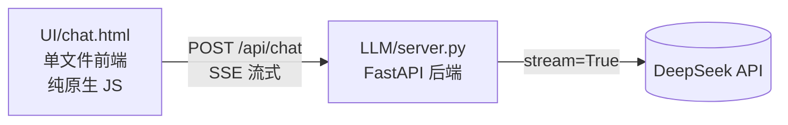

# AI 对话前端（流式输出）设计文档

日期：2026-08-18
状态：已批准（用户确认方案 A）

## 目标
做一个本地 AI 对话网页，支持 DeepSeek 流式输出（打字机效果），供学习使用。

## 架构



- API Key 只存在后端 `.env`，前端网页不暴露
- 前端是单个 `.html`，双击即可打开（file:// 也能跨源请求，靠 CORS）

## 技术选型（方案 A）

| 环节 | 选型 | 原因 |
|---|---|---|
| 后端 | FastAPI + `StreamingResponse` | 原生支持 SSE 流式转发 |
| 传输 | POST + 浏览器 `fetch` + `ReadableStream` | 可传消息体、无长度限制、浏览器兼容好 |
| 前端 | 纯 HTML + 原生 JS 单文件 | 零依赖、新手友好 |
| Markdown | `marked.js`（CDN） | 渲染回答中的代码/列表 |
| 代码高亮 | `highlight.js`（CDN） | 代码块带颜色 |

## 后端接口

`POST /api/chat`

请求体：
```json
{
  "messages": [{"role": "user", "content": "..."}],
  "thinking": true
}
```

响应：`text/event-stream`，逐条推送 SSE 事件：

```
data: {"type":"reasoning","content":"思考过程的增量"}

data: {"type":"content","content":"正式回答的增量"}

data: {"type":"done"}
```

## 前端功能

- 多轮对话记忆（前端维护 `messages` 数组，自动带历史）
- 流式打字机输出（fetch 读流，逐段追加）
- thinking 开关：开启后显示可折叠"思考过程"块，与正式回答分开
- Markdown 渲染 + 代码高亮
- 清空对话按钮
- 深色主题、中文界面

## 关键实现细节

1. **思考字段兼容**：用 `getattr(delta, "reasoning_content", None)` 安全取值
   —— thinking 关闭时服务器不返回该字段，直接访问会抛 `AttributeError`
2. **SSE 解析**：前端按 `\n\n` 分隔事件，`data: ` 前缀提取 JSON
3. **CORS**：`allow_origins=["*"]`，让 file:// 打开的页面也能请求
4. **.env 定位**：用 `Path(__file__).parent.parent` 定位项目根，避免工作目录不同找不到 key

## 运行方式

```bash
cd LLM
..\.venv\Scripts\python.exe -m uvicorn server:app --reload --port 8000
# 浏览器打开 UI/chat.html
```
