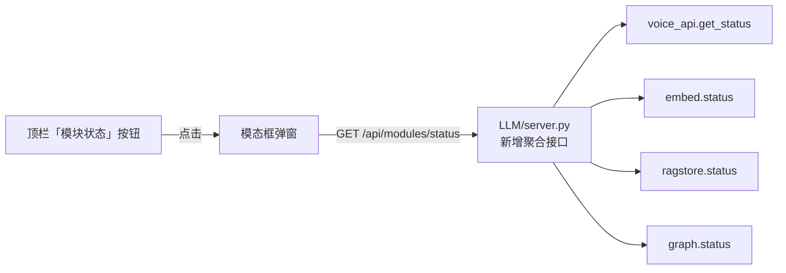

# 模块状态弹窗设计文档

日期：2026-08-24
状态：已批准（用户确认方案 B：后端加聚合接口）

## 目标

前端提供一个「模块状态」弹窗，打开即可看到后端各可选模块的加载/运行状态，
明确**哪个模块加载失败、缺了什么依赖**，方便排查部署环境问题。

## 背景

后端存在多个**可选能力模块**，外部依赖缺失时按「系统稳健性」原则降级运行，
后端照常启动、功能降级：

- 语音链路（`voice_api.py`）：缺 numpy / sherpa-onnx / sounddevice / modelscope 等 → `status: "unavailable"` + `reason`
- Embedding（`embed.py`）：缺 openai / dotenv / DASHSCOPE_API_KEY → `available: False` + `missing[]`
- RAG 存储（`ragstore.py`）：同上模式
- 知识图谱（`graph.py`）：缺 kuzu → `available: False` + `missing[]`

前端目前只在「记忆」页的知识图谱卡片里零散展示一处降级信息，没有全局视图。

## 方案（用户已确认：方案 B）

后端新增聚合接口 `GET /api/modules/status`，一次返回全部可选模块状态；
前端顶栏加「模块状态」入口按钮，点击弹出模态框展示列表。

## 架构



## 后端改动（LLM/server.py）

新增路由（按 AGENTS.md 惯例，路由放 server.py）：

```python
@app.get("/api/modules/status")
async def modules_status():
    from . import embed as e, ragstore, graph as g
    return {"ok": True, "modules": {
        "voice":    voice_api.get_status(),   # {status, reason?, voice_enabled, ...}
        "embed":    e.status(),               # {available, missing[]}
        "ragstore": ragstore.status(),
        "graph":    g.status(),
    }}
```

- 零新依赖；`embed.status()` 内部懒加载触发真实可用性判断。
- 纯查询接口，不写审计日志（查询类 API 惯例）。

## 前端改动（UI/index.html，单文件内完成）

### 顶栏入口

- `#health` 状态指示旁新增按钮 **「🔍 模块状态」**（id: `mod-status-btn`）。
- 任一模块为 ❌（不可用）或 ⚠️（降级/未启动）时，按钮加警示样式（红色描边/红点），
  提示"有模块异常，点击查看"；全部正常则为普通样式。

### 弹窗结构

- 遮罩层 + 居中卡片（深色主题，与现有 UI 一致）。
- 标题：「模块状态检测」+ 右上角关闭 ×。
- 模块列表，每行：模块名 + 状态徽标 + 说明：
  - **语音链路**：`running` → ✅ 运行中；`stopped` 且 `voice_enabled==false` → ⚪ 已停用（设置中关闭，非故障）；`stopped` 其他 → ⚠️ 未启动；`unavailable` → ❌ `reason`（缺失依赖列表）。
  - **Embedding 向量**：`available` → ✅ 可用；否则 ❌ 「缺失依赖：`missing.join("；")`」。
  - **RAG 存储**：同上。
  - **知识图谱**：同上。
- 底部按钮：「🔄 重新检测」（重新 fetch）、「关闭」。

### 数据加载

`loadModuleStatus()`：`fetch /api/modules/status` → 渲染列表 + 更新按钮警示色。
弹窗打开时触发一次；「重新检测」按钮再次触发。

## 状态判定表

| 模块 | 数据字段 | 展示 |
|---|---|---|
| 语音链路 | `status=="running"` | ✅ 运行中 |
| 语音链路 | `status=="stopped"` 且 `voice_enabled==false` | ⚪ 已停用（设置中关闭） |
| 语音链路 | `status=="stopped"` 其他 | ⚠️ 未启动 |
| 语音链路 | `status=="unavailable"` | ❌ `reason` |
| embed / ragstore / graph | `available==true` | ✅ 可用 |
| embed / ragstore / graph | `available==false` | ❌ 缺失依赖：`missing` |

## 错误处理

- 接口失败/后端离线 → 弹窗内显示「无法获取模块状态（后端离线）」，按钮保持普通样式。
- 单模块字段缺失时前端防御性兜底（`??` / `||` 默认值），不因单条异常导致整窗白屏。
- 关闭弹窗：点 ×、点遮罩、Esc 均可（实现简单版：× + 遮罩）。

## 测试

- 后端：`curl http://127.0.0.1:8000/api/modules/status`，验证 4 个模块字段齐全、格式一致。
- 前端：
  - 正常后端 → 4 模块 ✅，按钮普通样式；
  - 停掉语音依赖或设置 `voice_enabled=false` → 对应行变 ❌/⚠️，按钮变警示色；
  - 后端离线 → 弹窗显示离线提示；
  - 点「重新检测」刷新。

## 范围（YAGNI）

- 不做：自动弹出、设置页入口、模块详情二级页、定时轮询（仅手动刷新 + 打开时拉取）。
- 不改：现有 `/api/health`、`/api/memories/health` 接口（新增聚合接口与其并存）。

---

# 补充设计：模块状态弹窗内「警告/错误日志」（2026-08-24 追加，用户已确认）

## 目标

在模块状态弹窗内加一个「📋 警告/错误日志」按钮，按下后在**同一弹窗内**展示后端运行中遇到的所有
警告/错误类审计日志（如语音降级/报错、提醒 tick 异常、记忆整理失败、告警升级等），便于排查"到底出过什么事"。

## 背景：现有审计日志

后端 `LLM/log.py` 把全部事件 JSONL 落盘 `LLM/data/audit.jsonl`（`log(event, **fields)`，含
`ts` 时间戳）。事件类型：`chat` / `memory_change` / `reminder` / `tool` / `settings` / `alarm` /
`voice_degraded` / `voice_error` / `voice_state` / `system` / `memory_correct` / `graph` 等。
错误/警告类条目分散在多种事件中（`*_error` 动作、`alarm`、`voice_degraded`、`tick_error`、
`consolidate_error` 等），前端目前**没有任何接口能查这些日志**（`/api/tools/log` 只查工具调用记录，来自另一张表）。

## 方案（用户已确认）

- **数据接口**：后端新增 `GET /api/logs/warnings`（只读 `audit.jsonl` 末尾 N 条，**服务端过滤**警告/错误类，
  返回结构化列表），前端只管展示。
- **展示**：模块状态弹窗 footer 加「📋 警告/错误日志」按钮，点击后在弹窗 body 内展开日志列表区
  （模块状态 ⇄ 日志列表两个视图切换，一键切回）；日志为空显示「✅ 暂无警告/错误记录」。
- **范围**：只显示警告/错误类，不显示正常事件。

## 后端改动

### `LLM/log.py` — 新增读取函数

```python
def read_warnings(limit: int = 50) -> list[dict]:
    """读 audit.jsonl 末尾 limit 条，过滤警告/错误类事件（*_error / alarm / voice_degraded / *warn* / level 含 warn / 含 error 字段）。"""
    # 读文件 → 逐行解析 JSON（解析失败跳过）→ 匹配警告/错误规则 → 取末尾 limit 条
```

### `LLM/server.py` — 新增路由

```python
@app.get("/api/logs/warnings")
async def logs_warnings(limit: int = Query(50)):
    from . import log as audit
    return {"ok": True, "logs": audit.read_warnings(limit=limit)}
```

## 过滤规则（服务端，命中任一条即视为警告/错误）

- `action` 或 `event` 字段值含 `error`（如 `tick_error` / `consolidate_error` / `voice_error` / `ragstore_add_error`）
- `event == "alarm"` 或 `level` 字段值含 `warn`
- `event == "voice_degraded"`
- 存在 `error` 字段

## 前端改动（UI/index.html）

- `openModulesModal()` 的 modal footer 追加按钮「📋 警告/错误日志」。
- 点击后调用 `loadWarningsLog()`：`GET /api/logs/warnings` → 渲染日志列表到弹窗 body（替换模块列表视图），
  每条显示 `时间 · 事件 · 动作/说明`，错误（`error` 字段存在 / 事件含 error）红色，告警（alarm/warn）橙色。
- 视图切换：弹窗内一个"返回模块状态"链接/按钮切回模块列表；重新打开弹窗默认回到模块状态视图。
- 日志为空 → 「✅ 暂无警告/错误记录」。
- 无新弹窗；复用现有 `.mod-row` 样式或新增 `.log-row` 样式。

## 错误处理

- 后端离线/接口失败 → 日志区显示「无法获取日志（后端离线）」。
- 单条 JSON 解析失败 → 服务端跳过，不崩。
- 日志文件不存在（首次运行）→ 返回空列表，前端显示"暂无记录"。

## 测试

- 后端：`curl http://127.0.0.1:8000/api/logs/warnings` → 返回 `{"ok":true,"logs":[...]}`；
  造一条 `audit.log("voice_error", ...)` 后能查到；`limit` 参数生效。
- 前端：点「警告/错误日志」→ 列表展示；空日志 → 暂无记录；切回模块状态正常；后端离线 → 提示。

## 范围（YAGNI）

- 不做：日志详情二级页、按事件类型筛选、时间范围选择、日志持久化查询接口（直接读 JSONL）。
- 不改：现有 `/api/tools/log`；审计日志写入逻辑不动。

