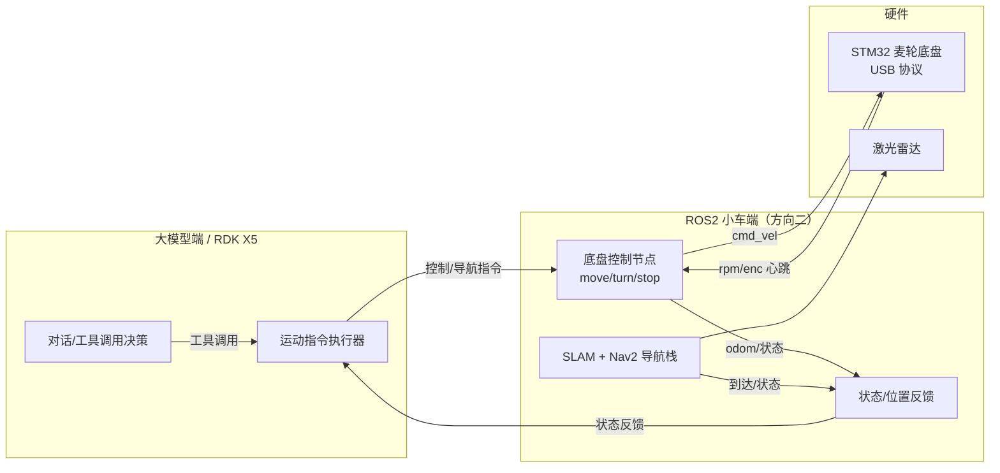

# ROS2 小车端（移动底盘与导航）开发目标

> **对应方向：** 《基于多模态大语言模型与边缘感知的一体化智能养老陪护巡逻系统》——方向二"边缘感知与夜间安防"之**核心任务 1「移动底盘与导航调试」**
> **运行载体：** 开发期 **WSL2 仿真**（ROS2 Humble + Gazebo + TurtleBot3）；真机期 **地瓜派 RDK X5 + STM32 麦轮底盘 + 激光雷达**
> **文档性质：** 开发目标规划（草案 v1），供团队讨论细化
> **整理日期：** 2026-08-19
> **上游接口契约：** 对接大模型端见 [`ROS底盘接口需求.md`](./ROS底盘接口需求.md)；下位机协议见 [`USB车控接口.md`](./USB车控接口.md)（STM32，v1.0）
> **配套学习教程：** [`教程_ROS2_SLAM小车实战.md`](../1.pre/教程_ROS2_SLAM小车实战.md)（跟着做就跑通）、[`教程_ROS2基础.md`](../1.pre/教程_ROS2基础.md)

---

## 一、定位与职责

小车端是机器人的"**腿和眼睛（运动/感知）**"：负责让小车**走得动、认得路、躲得开、报得准**，并承接大模型端（方向一）下达的运动指令。

一句话概括：**小车端负责"走得了、认得路、躲得开、报得准"**。



- **对外（大模型端）：** 只通过 ROS2 话题/服务交互，不直接碰硬件。
- **对内（硬件）：** 通过 USB CDC 协议（`USB车控接口.md` v1.0）驱动 STM32，STM32 负责麦轮逆解与四电机 PID，ROS 侧只管"车往哪走"。

---

## 二、范围界定（先对齐）

方向二一共 3 个核心任务，**本文档只覆盖任务 1**：

| 方向二核心任务 | 是否本文档范围 | 归属 |
|--------------|:---:|------|
| ① 移动底盘与导航（SLAM/自主导航/避障） | ✅ **是** | **ROS2 小车端（本文档）** |
| ② 低照度跌倒检测（YOLOv8-pose + 红外夜视） | ❌ 否 | 边缘视觉算法，非 ROS2 范畴，另行规划 |
| ③ 多源感知融合（毫米波雷达体征监测） | ❌ 否 | 进阶算法，另行规划 |

> ✅ **范围已定（2026-08-19）：** 本文档**仅覆盖"移动底盘与导航"**；传感器相关（跌倒检测 YOLOv8-pose、毫米波雷达体征监测）留到后面单独规划。

---

## 三、核心能力总览

| # | 能力 | 一句话说明 | 优先级 |
|:-:|------|-----------|:------:|
| 1 | 底盘控制节点 | 接收 move/turn/stop 并驱动底盘，到位自动停 | 🔴 高 |
| 2 | 状态反馈 | odom / 到达 / 电量 / 障碍 / 执行状态 上报 | 🔴 高 |
| 3 | SLAM 建图 | 让小车自己画出房间地图 | 🔴 高 |
| 4 | 自主导航与避障 | 地图内从 A 自主走到 B 并躲开障碍 | 🔴 高 |
| 5 | 地点语义化 | 地点表（去"客厅"）+ 语义区域（"在2号病房"） | 🟠 中 |
| 6 | 仿真验证环境 | WSL2 + Gazebo + TurtleBot3，先在仿真跑通 | 🔴 高 |
| 7 | 真机对接 | RDK X5 + STM32 USB + 真实雷达 | 🟠 中（后置） |

> **关键点：** 能力 1/2（底盘控制 + 状态）**不依赖地图**，能立刻解锁与大模型端联调；能力 3/4/5（SLAM/导航/语义）依赖地图，后置。**这与大模型端"先直行/转向、后导航到点"的既定策略一致。**

---

## 四、分模块详述

### 模块 1：底盘控制节点（核心，先做）

**目标：** 让小车"走得了"——收到指令真的动，到位自动停。

- 一个 ROS2 **Python 节点**（包名建议 `chassis_ctrl`），同时提供服务 + 订阅话题。
- **控制接口（下行，对接大模型端契约）：**
  - 服务 `robot/move`：`{direction: forward|back|left|right, distance_m: float}` → 直线/横移，到位自动停
  - 服务 `robot/turn`：`{angle_deg: float}` → 原地转向指定角度，到位自动停
  - 服务 `robot/navigate_to`：`{place: str}` 或 `{x, y, theta}` → 导航到点（**依赖 SLAM，后置**）
  - 话题 `robot/cmd_stop`：`std_msgs/Bool` → 高优先级急停，一收即停
- **执行链路：**
  ```
  指令 → 解析(安全校验) → 转 cmd_vel(Twist) → 下发底盘 → 订阅 odom 判到位 → 自动停
  ```
  - **仿真期：** `cmd_vel` 直接发布给 Gazebo 里的 TurtleBot3。
  - **真机期：** `cmd_vel` → USB 帧 `SET_CAR_VEL(vx, vy, ω)` → STM32（`USB车控接口.md` §5.2）。
- **方向约定（已定，惯用标准 REP-103）：** `forward/back` → `linear.x`（正=前）；`left/right` 横移 → `linear.y`（正=左）；转向 → `angular.z`（正=左转/逆时针）。**横移 `linear.y` 暂不做**（TurtleBot3 差速车验证不了，留到真机麦轮后置）。
- **固件方向核对（2026-08-19）：** STM32 固件 `mc_car_set` 与 USB 协议的**接口约定已是惯用标准**——`vx`正=前进、`vy`正=左移、`ω`正=左转，**无需改固件**。⚠️ 唯一待办：真机上实测各轴实际转向；若发现物理方向相反（取决于麦轮辊子朝向），在 `mc_car_set` 对应项取反即可（`WIRING.md` §5-P3 有记）。
- **到位判定：** 订阅 `/odom`，累计位移/角度达到目标即发 `stop`（全 0）并回响应。
- **安全兜底：** `distance_m`/`angle_deg` 超上限拒绝；执行超时（如 move 后 10s odom 无变化）自动 stop + 上报"过不去"。

### 模块 2：状态反馈

**目标：** 让大模型端知道"走到没、能不能走、还健不健康"。

| 数据 | 话题 | 类型/字段 | 用途 |
|------|------|-----------|------|
| 里程计/位姿 | `odom` | `x, y, theta` | 判是否到位、语义定位 |
| 到达状态 | `robot/arrived` | `bool + place` | 导航完成确认 |
| 电量 | `robot/battery` | `percent` | 低电量告警/回充 |
| 障碍/碰撞 | `robot/obstacle` | `bool + distance` | 避障/急停兜底 |
| 执行状态 | `robot/exec_state` | `idle/moving/navigating/error` | 大模型判小车在干嘛 |
| 当前位置 | `robot/current_place` | `place`（语义区域名） | "在2号病房13号床前" |

- **真机期：** STM32 每 100ms 心跳 `STATUS`（rpm/enc）→ 换算里程计；长时间收不到 STATUS 判 USB 断开。
- **电量/障碍：** 真机期由硬件或雷达代价地图提供（仿真期可先给模拟值）。

### 模块 3：SLAM 建图

**目标：** 让小车自己画出养老院房间地图。

- **仿真期：** `slam_toolbox`（Humble 官方工具），按教程第 4 步跑通：键盘开小车逛房间 → 边逛边出 `/map` → 保存地图文件。
- **真机期：** `cartographer` 或 `slam_toolbox` + 真实激光雷达，用真实底盘 TF。
- **产出：** 一张 `map.pgm` + `map.yaml`，供 Nav2 定位与导航使用。

### 模块 4：自主导航与避障

**目标：** 在地图内从 A 自主导航到 B 并避开障碍（教程第 5 步）。

- **技术栈：** Navigation2（Nav2）+ AMCL 定位 + 代价地图（Costmap）避障。
- **验收：** 仿真环境中，发布 2D Goal → 小车自主绕开障碍到达目标点。
- **真机期：** 把 Nav2 的目标输出 `cmd_vel` 对接到底盘控制层（走模块 1 的 USB 链路）。
- **语义导航：** 让大模型说"去客厅"→ 大模型端只传地点名 → 小车端查地点表得坐标 → 发 Nav2 目标。见模块 5。

### 模块 5：地点语义化（导航后置）

**目标：** 让大模型说"去客厅"而 ROS 知道坐标；说"我在哪"而 ROS 能答区域名。

- **地点表（地点→坐标）：** SLAM 建图后在图上标注生成，如
  ```json
  { "客厅": {"x":1.5,"y":2.0,"theta":0.0}, "卧室": {...}, "门口": {...} }
  ```
  大模型端只传**地点名**，未知地点由大模型端安全层直接拒绝。
- **语义区域框（坐标→区域，回答"我在哪"）：** 在地图上把"2号病房""13号床"画成矩形/多边形并命名；`get_location()` 由当前坐标匹配区域框，返回最细粒度 + 上级。见 `ROS底盘接口需求.md` 四·1。
- **归属待定：** 地点表/区域框由谁标注、放哪个节点加载、坐标→区域匹配放 ROS 侧还是大模型端（见第八节开放问题）。

### 模块 6：仿真验证环境

**目标：** 先在电脑仿真里跑通全部能力，再上真车。

- **环境：** WSL2 + Ubuntu 22.04 + ROS2 Humble + Gazebo + TurtleBot3 仿真包（`教程_ROS2_SLAM小车实战.md` 第 1 步）。
- **仿真车：** TurtleBot3 burger（自带激光雷达 + SLAM 支持，Humble 下最成熟开箱即用）。
- **模拟养老院世界：** 用 Gazebo 搭一个带房间/床位/走廊的世界，尽量贴近真实养老院布局。
- **⚠️ 已知限制：** TurtleBot3 是差速（非麦轮），只能直行/转向，验证不了横移 `linear.y`；横移留到真机（麦轮）验证。

---

## 五、硬件现状（先对齐）

- **底盘：** STM32F103ZETX 麦轮（X 型四轮）底盘，下位机固件已就绪（`stm32/control`），USB 协议 v1.0 已定稿（`USB车控接口.md`）。
- **激光雷达：** 已有（真机期接入）。
- **计算平台：** 地瓜派 RDK X5（8 核 A55 / 8GB / BPU 10TOPS），真机期部署 ROS2。
- **ROS2 真机环境未就绪：** 目前只有 STM32 固件 + USB 协议，**地瓜派上跑 ROS2 尚未开始**。所以先仿真、后真机。

---

## 六、开发路线（分阶段）

> 与大模型端并行开发；前 4 阶段纯仿真，阶段 5 起真机。

| 阶段 | 内容 | 依托教程 | 解锁能力 |
|:---:|------|---------|---------|
| 0 | 搭环境：WSL2 + Humble + TurtleBot3 仿真包 | 教程 第1步 | 仿真跑起来 |
| 1 | 小车动起来 + 键盘控制 + Rviz 看数据 | 教程 第2~3步 | 节点/话题/TF/URDF |
| 2 | SLAM 建图 + 保存地图 | 教程 第4步 | 能力 3 |
| 3 | Nav2 自主导航 + 避障 | 教程 第5步 | 能力 4 |
| 4 | 自写节点 + 自定义接口（move/turn 服务 + 状态话题），对接大模型端契约 | 教程 第6步 | 能力 1/2，**可联调** |
| 5 | 真机对接：RDK X5 + STM32 USB + 真实雷达；自定义麦轮 URDF 替换 TurtleBot3 | — | 能力 7（含横移） |
| 6 | 地点语义化（地点表 + 区域框）+ 与大模型端全链路联调 | — | 能力 5 |

> **衔接点：** 阶段 4 完成即能把大模型端当前的"模拟底盘"替换成真实 ROS2 客户端（接口不变，无缝切换，见 `ROS底盘接口需求.md` 第六节）。

---

## 七、与上游/下游的接口契约（遵守现状）

- **大模型端 → 小车端：** 控制用 **Service**（`robot/move`/`robot/turn`/`robot/navigate_to`），急停用 **Topic**（`robot/cmd_stop`）。字段见 `ROS底盘接口需求.md` 二、三节。
- **小车端 → STM32：** USB 帧协议 `USB车控接口.md` v1.0（`SET_CAR_VEL`/`STOP`/`TUNE_PID`/`GET_STATUS` + ACK/STATUS 心跳）。
- **小车端 → 大模型端：** 状态用 **Topic**（odom/arrived/battery/obstacle/exec_state/current_place）。
- **开发期模拟：** 大模型端已有"模拟底盘"自测，ROS2 就绪后替换，两边都不用改接口。

---

## 八、开放问题（需与团队/大模型端一起定）

**已定（2026-08-19）：**
- ✅ **范围：** 仅移动底盘与导航；传感器（跌倒检测/毫米波）后置。
- ✅ **方向标准：** 用惯用标准（REP-103：x 前 / y 左 / z 上、正角=左转）。固件接口已是此标准，无需改固件；真机实测再核物理方向。
- ✅ **仿真车：** TurtleBot3 差速车，先不涉及横移；横移留到真机麦轮后置。
- ✅ **ROS2 载体：** Humble（Ubuntu 22.04 / WSL2 仿真；真机 RDK X5 也装 Humble）。

**仍待定：**
1. **控制方式：** 确认控制走 Service、状态与急停走 Topic（建议，契约已倾向此方案）。
2. **`turn` 角度正负：** 固件 `ω`正=左转（= `angular.z` 正=左转），两端已一致；仅需在文档/代码注释里统一表述。
3. **地点表/语义区域框：** 由谁标注、放哪个节点加载、坐标→区域匹配放 ROS 侧还是大模型端？
4. **急停优先级：** 是否由 STM32 硬件层直接接管急停（绕过 ROS），保证最高优先级？

---

## 九、验收标准

- [ ] **阶段验收 1（仿真动起来）：** `ros2 topic list` 见 `/scan`/`/odom`/`/cmd_vel`，键盘能控制小车在 Gazebo 移动。
- [ ] **阶段验收 2（SLAM）：** 仿真中小车逛一圈，`/map` 出一张能用的房间地图并保存。
- [ ] **阶段验收 3（导航）：** 仿真中发布 2D Goal，小车从 A 自主绕障到达 B。
- [ ] **阶段验收 4（接口联调）：** `robot/move`/`robot/turn` 服务 + 状态话题跑通，大模型端通过 ROS2 客户端（替换模拟底盘）能让小车动、读到 odom/exec_state。
- [ ] **真机验收：** 地瓜派 + STM32 USB 链路驱动麦轮底盘，横移/直行/转向正确；激光雷达建图、自主导航到地点表目标。
- [ ] **语义验收：** `get_location()` 能答出"2号病房13号床前"，`navigate_to("客厅")` 能到点。

---

*本文档为开发目标草案 v1，随讨论与开发迭代更新。*
